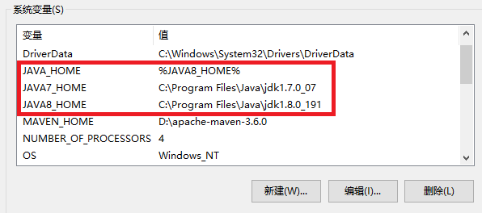
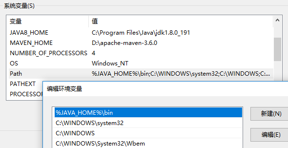

## 1、简介

| 术语                     | 缩写 |                       说明                        |
| :----------------------- | :--: | :-----------------------------------------------: |
| Java Development Kit     | JDK  | Java 开发工具包，提供了 Java 的开发环境和运行环境 |
| Java Runtime Environment | JRE  |    Java 运行环境，为 Java 的运行提供了所需环境    |
| Standard Edition         |  SE  |   标准版，用于桌面或简单服务器应用的 Java 平台    |
| Enterprise Edition       |  EE  |      企业版，用于复杂服务器应用的 Java 平台       |

### 1.1  Java 特点

简单性、面向对象、分布式、健壮性、安全性、体系结构中立、可移植性、解释型、高性能、多线程、动态性

### 1.2  Java 跨平台原理（Write Once，Run Everywhere）

​		Java 程序是在 JVM 上运行的，不是直接在电脑上运行的，Java 代码首先被编译成字节码文件（`.class`），**字节码不能直接运行，必须通过 JVM 翻译成机器码才能运行**

​		在 Java 中有第一次编译，还有第二次解释来适应不同平台，根据不同的平台进行解释执行。**翻译一句，执行一句**，不产生整个的机器代码程序。翻译过程如果不出现错误，就一直进行到完毕，否则将在错误处停止执行

- 不同平台（Windows、Linux 等）下编译生成的字节码是一样的，但由 JVM 翻译成的机器码却不一样
- JVM 是一个软件，用 C/C++ 开发，不同的平台有不同的版本，**跨平台的是 Java 程序，不是 JVM**。即使将 Java 程序打包成可执行文件，**仍然需要 JVM 的支持**

*更多：[Java跨平台原理及Java的安全性](https://segmentfault.com/a/1190000022865032)*

### 1.3  环境配置与版本切换





```bash
# 检查是否安装成功
java -version
```

## 2、数据类型

​		Java 语言是强类型语言，这就意味着必须为每一个变量声明一种类型。不同的数据类型，在内存中分配了不同的内存空间。在定义变量的时候，声明变量的数据类型，就会为变量 **合理的分配内存空间，避免空间浪费**

- 基本类型：**保存在栈内存中的简单数据段**
- 引用类型：**保存在堆内存中的对象**

*更多：[Java基本数据类型和引用类型](https://zhuanlan.zhihu.com/p/28654272)*

### 2.1  数据存储

| 存储位置                           | 简介                                                         | 备注                                                         |
| :--------------------------------- | ------------------------------------------------------------ | ------------------------------------------------------------ |
| **寄存器（Registers）**            | 最快的存储区域，位于 CPU 内部。但寄存器的数量十分有限，所以寄存器根据需求进行分配 | 我们对其没有直接的控制权，也无法在自己的程序里找到寄存器存在的踪迹 |
| **栈内存（Stack）**                | 存在于常规内存 RAM（随机访问存储器）区域中，可通过栈指针获得处理器的直接支持。**栈指针下移分配内存，上移释放内存**。这是一种 **仅次于寄存器的非常快速有效的分配存储方式** | 创建程序时，Java 系统必须知道栈内保存的所有项的生命周期。这种约束限制了程序的灵活性。因此，虽然在栈内存上存在一些 Java 数据（如对象引用），但 Java 对象本身的数据却是保存在堆内存的 |
| **堆内存（Heap）**                 | 存在于常规内存 RAM 区域中，是一种通用的内存池，**所有 Java 对象都存在于其中**。与栈内存不同，编译器不需要知道对象必须在堆内存上停留多长时间。因此，**用堆内存保存数据更具灵活性** | 这种灵活性是有代价的：分配和清理堆内存要比栈内存需要更多的时间。但 Java 的堆内存分配机制现在已经非常快，因此这不是一个值得关心的问题了 |
| **常量存储（Constant storage）**   | 常量值通常直接放在程序代码中，因为它们永远不会改变。如需严格保护，可考虑将置于只读存储器 ROM（只读存储器）中 |                                                              |
| **非 RAM 存储（Non-RAM storage）** | 数据完全存在于程序之外，在程序未运行以及脱离程序控制后依然存在。两个主要的例子：序列化对象、持久化对象 | 这些存储的方式都是将对象转存于另一个介质中，并在需要时恢复成常规的、基于 RAM 的对象。Java 为轻量级持久化提供了支持。而诸如 JDBC 和 Hibernate 这些类库为使用数据库存储和检索对象信息提供了更复杂的支持 |

### 2.2  基本数据类型（primitive type）

|   数据类型   | 关键字  | 存储需求 |               取值范围                | 默认值 |  包装类   |
| :----------: | :-----: | :------: | :-----------------------------------: | :----: | :-------: |
|    字节型    |  byte   |    1     |              -128 ~ 127               |   0    |   Byte    |
|    短整型    |  short  |    2     |  -2<sup>15</sup> ~ 2<sup>15</sup> -1  |   0    |   Short   |
|     整型     |   int   |    4     |  -2<sup>31</sup> ~ 2<sup>31</sup> -1  |   0    |  Integer  |
|    长整型    |  long   |    8     |  -2<sup>63</sup> ~ 2<sup>63</sup> -1  |   0    |   Long    |
| 单精度浮点型 |  float  |    4     |                IEEE754                |  0.0   |   Float   |
| 双精度浮点型 | double  |    8     |                IEEE754                |  0.0   |  Double   |
|    字符型    |  char   |    2     | Unicode 0 ~ Unicode 2<sup>16</sup> -1 | \u0000 | Character |
|    布尔型    | boolean |    1     |              true、false              | false  |  Boolean  |

```java
// long类型后缀：l 或 L
long l1 = 1l;
long l2 = 1L;

// float类型后缀：f 或 F
float f1 = 0.1f;
float f2 = 0.1F;

// double类型后缀：d 或 D
double d1 = 0.1d;
double d2 = 0.1D;

// 二进制前缀：0b 或 0B
int i1 = 0b1011;
int i2 = 0B1011;

// 十六进制前缀：0x 或 0X
int x1 = 0x99f;
int x2 = 0X99F;
```

- **浮点型没有后缀的话，默认为 double 类型**
- 不建议用浮点型表示金额，因为计算机中保存的小数其实是十进制的小数的近似值，并不是准确值
  - 建议使用 BigDecimal 或者 Long（单位为分）来表示金额
- 可以为数字字面量加下划线，只是为了更易读，Java 编译器会去除这些下划线
  - `int i = 1_000_000`
- char 类型的字面量值要用单引号括起来，用来存储 Unicode 编码的字符
  - 因为 Unicode 编码字符集中也包含了汉字，所以 **char 类型可以存储一个汉字**
  - Unicode 类编码占用 2 个字节，所以 char 类型的变量也是占用 2 个字节
- **多种数据类型做混合运算，先转换成容量最大的那种再做运算**
  - 八大基本数据类型，**除 boolean 类型之外都可以相互转换**
  - **byte、short、char 做混合运算的时候，会先转换成 int 再做运算**

```java
short s1 = 1;
short s2 = 2;

short s = s1 + s2;	// 报错，需用int类型接受，或强转成short类型
int s = s1 + s2;	// 正确编译，用int类型接受
short s = (short) (s1 + s2);	// 正确编译，强转成short类型
```

```java
short s = 1;
s = s + 1;	// 报错，由于s1+1运算时 会自动提升表达式的类型，所以结果是int型
s += 1;		// 正确编译，因为+=是Java语言规定的运算符，Java编译器会对它进行特殊处理
```

### 2.3  枚举类型

​		有时变量的取值只在一个有限的集合内，枚举类型包括有限个命名的值。所有的枚举类型都是 Enum 类的子类。在创建枚举时，编译器会自动创建 `toString()` 方法，以便方便地显示某个枚举实例的名称。还会创建 `ordinal()` 方法表示某个特定枚举常量的声明顺序

```java
enum Color {
    red, black, white, green
}

public class Test {
    public static void main(String[] args) {
        // Color类型的变量只能存储这个类型声明中给定的某个枚举值，或者null值
        // null表示这个变量没有设置任何值
        // 返回枚举常量名
        Color.black;						// black
        // 返回序号
        Color.green.ordinal();				// 3
        // 返回一个包含全部枚举值的数组
        Color[] colors = Color.values();	// [red, black, white, green]
    }
}
```

### 2.4  参数传递

Java 中方法参数传递方式是 **按值传递**

- 基本类型，传递的是基本类型的 **字面量值的拷贝**，不改变其值
- 引用类型，传递的是该参数所引用的对象在堆中 **地址值的拷贝**，改变其值
  - String 类虽然是引用数据类型，但它做参数传递时和基本数据类型是一样的

*更多：[Java 到底是值传递还是引用传递](https://www.zhihu.com/question/31203609)*

## 3、运算符

- **运算符存在优先级，在使用时应用括号明确规定运算顺序**

```java
// 整数被0除将会产生一个异常，而浮点数被0除将会得到无穷大或NaN结果
// ArithmeticException: / by zero
System.out.println(1/0);
// Infinity
System.out.println(1.0/0);
```

- `&&` 与 `&` 的区别
  - `&&`：具有短路效果。如果左边结果是 false，则右边不执行
  - `&`：无论左边是 false 还是 true，右边都会执行
- `||` 与 `|` 的区别
  - `||`：具有短路效果。如果左边结果是 true，则右边不执行
  - `|`：无论左边是 false 还是 true，右边都会执行
- `++n` 与 `n++` 的区别
  - 前缀形式会先完成加 1，然后再执行其他操作
  - 后缀形式会使用变量原来的值，执行完操作后，再进行加 1
  - 建议不要在表达式中使用 `++ `，因为这样的代码很容易让人闲惑 ， 而且会带来烦人的 bug

- `^`：逻辑异或，两边只要是不一致就是 true

- `=`：赋值运算符
  - 基本类型，赋值运算符会直接改变变量的值，原来的值被覆盖掉
  - 引用类型，赋值运算符会改变引用中所保存的地址，原来的地址被覆盖掉。**但是原来的对象不会被改变**

- 移位运算符
  - `<<`：左移运算符，`num << 1`，相当于 num 乘以 2
  - `>>`：右移运算符，`num >> 1`，相当于 num 除以 2
  - `>>> `：无符号右移，忽略符号位，空位都以 0 补齐

```java
// 以下数据类型为int
 7：00000000000000000000000000000111
// -7的二进制为7的反码加上补码1，正数的原码、反码、补码相同
-7：11111111111111111111111111111001    // 末尾1表示-1，0表示-2

  7<<1：00000000000000000000000000001110		// 结果为14
  7>>1：00000000000000000000000000000011		// 结果为3
 -7<<1：11111111111111111111111111110010		// 结果为-14
 -7>>1：11111111111111111111111111111100		// 结果为-4
-7>>>1：01111111111111111111111111111100		// 结果为2147483644
```

- 三元运算符：`布尔表达式 : 值1 ? 值2`，表达式为 true，返回 `值1`，表达式为 false，返回 `值2`

- `==` 与 `equals()`
  - `==`：**基本数据类型比较的是值，引用数据类型比较的是内存地址**
- `equals()`：如果被重写，则比较两个对象内容是否相等，否则，比较的是内存地址
  - String、Integer 等中的 equals 方法是被重写过的，因为 Object 的 equals 方法是比较的对象的内存地址，而 String 的 equals 方法比较的是对象的值

### 3.1  注释

```java
// 单行注释：只能注释一行内容，用在注释信息内容少的地方

/* 
   长注释：能注释很多行的内容
*/

/**
 * 文档注释：可以用来自动地生成文档，常用于类与方法注释
 */
```

## 4、控制流程

- switch 语句将从与选项值相匹配的 case 标签处开始执行直到遇到 break 语句，或者执行到 switch 语句的结束处为止。如果没有相匹配的 case 标签，而有 default 子句，就执行这个子句
  - 条件括号中可以填写 byte、short、char、int 类型，即 **能够自动转换为 int 类型** 的都可以
  - 在 JDK7 之后可以填写 String 类型
  - **case 后面只能是常量**，不能是变量，**case 的值不能重复**

- while 循环本质上和 for 循环是一样的，可以相互替换，作用相同，建议使用 for 循环，因为变量会及早的从内存中消失，可以提高内存的使用效率
  - while 循环会首先检测循环条件，因此，循环体中的代码可能不会被执行，如果需要至少执行一次，可以使用 `do / while` 循环

- break、continue、return 区别
  - break：跳出一层循环，可以控制结束嵌套循环
  - continue：结束一趟循环，也可以像 break 那样加上循环的名字（goto）
  - return：它的作用不是结束循环的，而是结束方法

## 5、数组

数组是一种简单的数据结构，线性的结构，是相同数据类型的元素按一定顺序排列的集合。通过一个整型下标可以访问数组中的每一个值

- 数组和集合区分开的原因：效率，类型，保存基本数据类型的能力

### 5.1  初始化数组

​		数组初始化就是为数组开辟 **连续的内存空间**，并为每个数组元素赋予值。知道数组的首元素的内存地址，只要知道下标就可以快速的计算出偏移量，通过首元素内存地址加上偏移量可以快速计算出要查找元素的内存地址，通过内存地址快速定位该元素，所以数组查找元素的效率较高

- 数组是简单的线性序列，这使得对元素的访问变得非常快。然而这种高速也是有代价的，代价就是数组对象的大小是固定的，且在该数组的生存期内不能更改

- 动态初始化数组，会先在堆内存中分配这个数组，并且数组中每一个元素都采用 **默认值**

```java
// 静态初始化
int[] arr = {1, 2, 3, 4, 5};
// 动态初始化
int[] arr = new int[5];
```

### 5.2  二维数组

```java
// {{0,0,0},{0,0,0}}
int[][] arr = new int[2][3];

// 遍历
for (int i = 0; i < arr.length; i++) {
    for (int j = 0; j < arr[i].length; j++) {
        System.out.print(arr[i][j]);
    }
}
```

### 5.3  常用方法

```java
// 返回一个List
Arrays.asList(数组);

// 排序，使用了优化的快速排序算法
Arrays.sort(数组);

// 二分法查找，返回下标
Arrays.binarySearch(数组, 需要查找的元素);

// 数组转字符串
Arrays.toString(数组);

// 填充数组
Arrays.fill(数组, 需要填充的元素);

// 复制数组
Arrays.copyOf(数组, 新数组的长度);

// 复制数组
Arrays.copyOfRange(数组, 起始下标, 结束下标);
```

## 6、万物皆对象

|                           面向过程                           |                           面向对象                           |
| :----------------------------------------------------------: | :----------------------------------------------------------: |
|  把问题分解成一个一个步骤，每个步骤用函数实现，依次调用即可  | 将问题分解成一个一个步骤，**把每个步骤抽象成对象**，通过不同对象之间的调用，组合解决问题 |
| 注重 **过程**，把问题分解成多个不同的步骤，然后把各个步骤变成方法，使用的时候依次调用 | 注重 **对象之间的交互**，将复杂的事情简单化，把问题分解成各个对象，然后各个对象之间进行交互，每个对象内部都进行了封装 |
| 性能比面向对象高，类调用时需要实例化，开销比较大，比较消耗资源 | 易维护、易复用、易扩展，由于面向对象有封装、继承、多态性的特性，可以设计出低耦合的系统，使系统更加灵活、更加易于维护 |

* 类：**具有相同属性和方法的一组对象的集合**，是构造对象的模板或蓝图

- 包：在类名前面使用关键字 package 加入包名来避免命名冲突问题，通常使用倒写的域名命名
  - package 语句只能出现在 Java 文件的第一行，且只能有一个
  - 如果没有 package，默认表示无包名
  - Java.lang 包下所有类不需要手动导入，系统自动导入，Object 类，String 类都在这个包里面
- 方法：为了完成某个任务，对象所能执行的操作，可以提高代码的复用性
  * 不要在两个方法里面互相调用，程序会报出 StackOverflowError 错误
  * 方法自己调用自己叫做递归，必须要有结束条件，否则将会造成 StackOverflowError 错误
- 对象：**系统中描述客观事物的一个实体**

## 7、面向对象三大特性

### 7.1  封装

把客观事物封装成抽象的类，**隐藏对象的属性和实现细节，仅对外提供公共访问方式**。不用关心具体实现，提高安全性，提高了代码的复用性，减少耦合

- 封装的使用
  - 将成员变量用 private 修饰，private 仅仅是封装的一种体现形式，**封装不是私有**

  - 提供对应的 get 和 set 方法

### 7.2  继承

**子类自动共享父类数据结构和方法的机制**，是类之间的一种关系。在定义和实现一个类的时候，可以在一个已经存在的类的基础之上来进行，把这个已经存在的类所定义的内容作为自己的内容，并加入若干新的内容。**Java 只支持单继承和多层继承**，子类可以继承父类中的 **非 private 修饰的成员方法和成员变量，构造方法不能被继承**

- 如果一个类没有显示的继承其他类，那么这个类会 **默认继承 Object 类**，Object 是 SUN 公司提供的 Java 中的根类

* 提高了代码的复用性、维护性
* 让类与类之间产生了关系，是多态的前提

* 增强了类之间的耦合，软件开发的一个原则是 **高内聚，低耦合**
  * 内聚：一个模块内各个元素彼此结合的紧密程度
  * 耦合：一个软件里面不同模块之间相互连接的数量

### 7.3  多态

**一种行为，多种状态**。同一操作作用于不同的对象，可以有不同的解释，产生不同的执行结果。**提高了程序的扩展性，降低了代码之间的耦合**

- 多态的实现
  - 有继承
  - 有方法重写
  - 有父类引用指向子类对象

* 动态绑定：在运行根据具体对象的类型进行绑定
* 静态绑定：在程序执行前已经被绑定

- 类型转换：子类向父类型进行转换，是 **自动类型转换**，也叫向上转型。父类向子类型转换，是 **强制类型转换**，也叫向下转型。如果有多个子类需要强转的话，需要先使用 `instanceof` 判断一下对象属于哪个子类

```java
public class Demo {
    public static void main(String[] args) {
        Father demo = new Son();
        demo.same();// same son
        demo.differentFather();// different father
        ((Son) demo).differentSon();// different son
        System.out.println(demo.num);// 111
        System.out.println(demo.fatherNum);// 666
        System.out.println(((Son) demo).sonNum);// 999
    }
}

class Father {
    public int num = 111;
    public int fatherNum = 666;

    public void same() {
        System.out.println("same father");
    }

    public void differentFather() {
        System.out.println("different father");
    }
}

class Son extends Father {
    public int num = 222;
    public int sonNum = 999;

    @Override
    public void same() {
        System.out.println("same son");
    }

    public void differentSon() {
        System.out.println("different son");
    }
}
```

## 8、面向对象七大基本原则

### 8.1  单一职责原则（Single-Responsibility Principle）

**一个类应该只有一个能引起变化的原因**，一个类的功能要单一，只做与它相关的事情

- 职责过多，可能引起它变化的原因就越多，这将导致职责依赖，相互之间就产生影响，从而大大损伤其内聚性和耦合度

#### 8.1.1  优点

- 类的复杂性降低，实现什么职责都有清晰明确的定义
- 可读性提高
- 可维护性提高
- 变更引起的风险降低，变更是必不可少的，如果接口的单一职责做得好，一个接口修改只对相应的实现类有影响，对其他的接口无影响，这对系统的扩展性、维护性都有非常大的帮助

### 8.2  开放封闭原则（Open-Closed principle）

**软件实体（类，模块，函数等）应该是可扩展的，而不可修改的**。实现该原则的核心思想就是对抽象编程，而不对具体编程，因为抽象相对稳定

- 对扩展开放：有新的需求或变化时，可以对现有代码进行扩展，以适应新的情况
  - 通过面向对象的继承和多态，使用重写来改变固有行为，实现新的拓展方法，所以扩展是开放的
- 对修改封闭：类一旦设计完成，就可以独立完成其工作，而不要对其进行任何的修改
  - 让类依赖于固定的抽象，所以修改就是封闭的

#### 8.2.1  优点

- 有利于进行单元测试
- 复用性提高
- 可维护性提高
- 面向对象开发的要求
- 保持软件内部的封装体系稳定，不被需求的变化影响

### 8.3  里氏替换原则（Liskov-Substitution Principle）

**子类应当可以替换父类并出现在父类能够出现的任何地方**。这一思想体现为对继承机制的约束规范，只有子类能够替换父类时，才能保证系统在运行期内识别子类，这是保证继承复用的基础

- 这一约束反过来则是不成立的，子类可以替换基类，但是基类不一定能替换子类

该原则主要着眼于对抽象和多态建立在继承的基础上，因此只有遵循了里氏替换原则，才能保证继承复用是可靠的。实现的方法是面向接口编程：将公共部分抽象为接口或抽象类，在子类中通过覆写父类的方法实现新的方式支持同样的职责

- 里氏替换原则是关于继承机制的设计原则，违反了该原则就必然导致违反开放封闭原则。 里氏替换原则能够保证系统具有良好的拓展性，同时实现基于多态的抽象机制，能够减少代码冗余，避免运行期的类型判断

#### 8.3.1  优点

- 代码共享，减少创建类的工作量，每个子类都拥有父类的方法和属性
- 提高代码的重用性
- 提高代码的可扩展性
- 提高项目的开放性
- 子类可以形似父类，但是又异于父类

### 8.4  依赖倒置原则（Dependecy-Inversion Principle）

**具体依赖抽象，上层依赖下层**。高层模块不依赖于底层模块，二者都同依赖于抽象；抽象不依赖于具体，具体依赖于抽象

依赖一定会存在于类与类、模块与模块之间。当两个模块之间存在紧密的耦合关系时，最好的方法就是分离接口和实现：在依赖之间定义一个抽象的接口使得高层模块调用接口，而底层模块实现接口的定义，以此来有效控制耦合关系，达到依赖于抽象的设计目标

- 抽象的稳定性决定了系统的稳定性，因为抽象是不变的，依赖于抽象是面向对象设计的精髓，也是依赖倒置原则的核心

#### 8.4.1  优点

- 通过依赖于接口，隔离了具体实现类
- 低一层的变动并不会导致高一层的变动
- 提高了代码的容错性、扩展性和易于维护

### 8.5  接口隔离原则（Interface-Segregation Principle）

**客户端不应该依赖它不需要的接口，一个类对另一个类的依赖应该建立在最小的接口上**。 接口应该是内聚的，应该避免大接口。接口有效地将细节和抽象隔离，强调了接口的单一性

- 单一职责原则要求是类和接口的职责单一，注重的职责，接口隔离原则是业务逻辑上的划分，要求接口的方法尽量少

大接口存在明显的弊端，会导致实现的类型必须完全实现接口的所有方法、属性等；而某些时候，实现类型并非需要所有的接口定义，而且对大接口的修改将导致一连串的程序需要修改。将大接口分解为多个特点的定制化方法，使得客户端仅仅依赖于它们的实际调用的方法，从而解除了客户端不会依赖于它们不用的方法

分离的手段主要有两种

- 委托分离，通过增加一个新的类型来委托客户的请求，隔离客户和接口的直接依赖，但是会增加系统的开销
- 多重继承分离，通过接口多继承来实现客户的需求，推荐

#### 8.5.1  优点

- 避免接口污染
- 灵活性提高
- 提供定制服务
- 实现高内聚

### 8.6  最少知道原则 / 迪米特法则（Least Knowledge Principle）

**一个对象应当对其他对象有尽可能少的了解**，每个类尽量减少对其他类的依赖

该原则不希望类之间建立直接的接触，如果真的有需要建立联系，也希望能通过中间类来转达。因此，应用迪米特原则有可能造成的一个后果就是：系统中存在大量的中介类，这些类之所以存在完全是为了传递类之间的相互调用关系，在一定程度上增加了系统的复杂度

#### 8.6.1  优点

- 减少对象之间的耦合性

### 8.7  组合 / 聚合复用原则（Composite / Aggregate Reuse Principle）

**在一个新的对象里面使用一些已有的对象，使之成为新对象的一部分**，新对象通过向这些对象的委派达到复用已有功能的目的。尽量的使用合成和聚合，而不是继承关系达到复用的目的

- 组合（Composition）表示一种强的拥有关系，体现了严格的部分和整体关系，部分和整体的生命周期一样

- 聚合（Aggregation）表示一种弱的拥有关系，体现的是 A 对象可以包含 B 对象但 B 对象不是 A 对象的一部分

#### 8.7.1  优点

- 新的实现较为容易，因为超类的大部分功能可通过继承关系自动进入子类
- 修改或扩展继承而来的实现较为容易

#### 8.7.2  组合与继承

|                        组 合 关 系                         |                         继 承 关 系                          |
| :--------------------------------------------------------: | :----------------------------------------------------------: |
|     不破坏封装，整体类与局部类之间松耦合，彼此相对独立     | 破坏封装，子类与父类之间紧密耦合，子类依赖于父类的实现，子类缺乏独立性 |
|                     具有较好的可扩展性                     |        支持扩展，但是往往以增加系统结构的复杂度为代价        |
| 支持动态组合。在运行时，整体对象可以选择不同类型的局部对象 |       不支持动态继承。在运行时，子类无法选择不同的父类       |
| 整体类可以对局部类进行包装，封装局部类的接口，提供新的接口 |                    子类不能改变父类的接口                    |
|            整体类不能自动获得和局部类同样的接口            |                   子类能自动继承父类的接口                   |
|        创建整体类的对象时，需要创建所有局部类的对象        |             创建子类的对象时，无须创建父类的对象             |

- 建议在同样可行的情况下，优先使用组合而不是继承。因为组合更安全，更简单，更灵活，更高效
  - 只有当子类真正是超类的子类型时，才适合用继承

## 9、创建对象的五种方法

```java
public class Test implements Cloneable, Serializable {
    // 1、new关键字
    public Test method01() {
        return new Test();
    }

    // 2、Class类的newInstance方法
    public Test method02() throws Exception {
        // 第一种写法，需填入类的全限定名
        Test test = (Test) Class.forName("com.test.Test").newInstance();
        // 第二种方法
        return Test.class.newInstance();
    }

    // 3、Constructor类的newInstance方法
    public Test method03() throws Exception {
        Constructor<Test> constructor = Test.class.getConstructor();
        return constructor.newInstance();
    }

    // 4、Clone方法
    public Test method04() throws Exception {
        return (Test) new Test().clone();
    }
	// 重写clone方法
    @Override
    protected Object clone() throws CloneNotSupportedException {
        return super.clone();
    }

    // 5、反序列化，需要先让类实现Serializable接口
    public Test method05() throws Exception {
        String file = "test";
        // 序列化
        Test test = new Test();
        ObjectOutputStream oos = new ObjectOutputStream(new FileOutputStream(file));
        oos.writeObject(test);
        oos.flush();
        // 反序列化
        ObjectInputStream ois = new ObjectInputStream(new FileInputStream(file));
        return (Test) ois.readObject();
    }
}
```

* 调用一个对象的 clone 方法，JVM 会创建一个新的对象，将之前对象的内容全部拷贝进去
  * **用 clone 方法创建对象不会调用任何构造方法**
* 当序列化和反序列化一个对象，JVM 会给我们创建一个单独的对象。在反序列化时，JVM 创建对象 **并不会调用任何构造方法**

### 9.1  两种 newInstance 方法的区别

|           Class 类的 newInstance           |              构造器类的 newInstance              |
| :----------------------------------------: | :----------------------------------------------: |
|       Class 类位于 Java 的 lang 包中       |         构造器类是 Java 反射机制的一部分         |
|    只能触发 **无参的构造方法** 创建对象    |   能触发 **无参的或有参的构造方法** 来创建对象   |
| 需要其构造方法是共有的或者对调用方法可见的 | 可以在特定环境下调用 **私有构造方法** 来创建对象 |
|            抛出类构造函数的异常            |    包装了一个 InvocationTargetException 异常     |

* Class 类本质上调用了反射包构造器类中无参数的 newInstance 方法，捕获了 InvocationTargetException，将构造器本身的异常抛出

*更多：[Java中创建对象的 5种方式](https://www.cnblogs.com/wxd0108/p/5685817.html)*

## 10、权限修饰符

可以限定其他类对该类、属性和方法的使用权限，**protected 和 private 不能用于修饰类**

- 如果使用 private 修饰类，那么这个类不能创建实例，这个类的属性和方法不能被访问，那么创建这个类毫无意义
- 如果使用 protected 修饰类，与该类不同包的类想要访问该类，就必须继承这个类，但前提是不同包的类能访问到这个类，这就产生了冲突

|  修饰符   | 同一个类 | 同一个包 | 子类 | 其他包 |
| :-------: | :------: | :------: | :--: | :----: |
|  public   |    〇    |    〇    |  〇  |   〇   |
| protected |    〇    |    〇    |  〇  |   X    |
|  default  |    〇    |    〇    |  X   |   X    |
|  private  |    〇    |    X     |  X   |   X    |

*更多：[Java的外部类为什么不能使用private、protected进行修饰](https://www.cnblogs.com/AleiCui/p/12792565.html)*

## 11、成员变量与局部变量

|                         成员变量                         |                 局部变量                 |
| :------------------------------------------------------: | :--------------------------------------: |
|                     写在方法体的外面                     |             写在方法体的里面             |
| 声明时可以不进行初始化值，**会自动以类型的默认值而赋值** |           声明时必须进行初始化           |
|             可以被本类或其他类的方法进行调用             |    只能在声明局部变量的方法内进行调用    |
|           可以被访问控制修饰符及 static 所修饰           | **不能被访问控制修饰符及 static 所修饰** |
|            存在于堆内存，随着对象的创建而存在            |  存在于栈内存，随着方法的调用而自动消失  |

## 12、构造方法

为对象数据进行初始化

* 方法名与类名相同，**不能被继承，因此不能被重写，但可以被重载**
* 没有返回值类型，不能使用 return 返回值，不能被 void 修饰
* 如果一个类没有提供任何构造方法，系统 **默认提供一个无参数构造方法**。如果一个类已经手动的提供了构造方法，那么系统不会再提供任何构造方法。如果需要使用无参构造方法，就必须显式的写出
* 在创建对象的时候会 **默认执行无参构造方法，构造方法不能手动调用**

### 12.1  创建对象的过程

1. 当首次创建 `Test` 类型的对象或是首次访问该类的静态方法或属性时，Java 解释器必须在类路径中查找，以定位 `Test.class`
2. 当加载完 `Test.class` 后，将创建一个 `Class` 对象，有关静态初始化的所有动作都会执行。因此，静态初始化只会在首次加载 `Class` 对象时初始化一次
3. 当用 `new Test()` 创建对象时，首先会在堆上为 `Test` 对象分配足够的存储空间
4. 分配的存储空间首先会被清零，即会将 `Test` 对象中的所有基本类型数据设置为默认值，引用被置为 `null`
5. 执行所有出现在字段定义处的初始化动作
6. 执行构造器

## 13、重载与重写

|                     方法重载（Overload）                     |                     方法重写（Override）                     |
| :----------------------------------------------------------: | :----------------------------------------------------------: |
|                       发生在同一个类中                       |                必须继承一个类或者实现一个接口                |
|  **方法名相同，参数列表不同，与方法返回值类型、修饰符无关**  |       必须具有 **相同的方法名、返回值类型和参数列表**        |
| **编译期绑定**，在编译时根据参数变量的类型判断应该调用哪个方法 | **运行期绑定**，在运行的时候，根据引用变量所指向的实际对象的类型来调用方法 |
|                              空                              | 重写的方法 **不能比被重写的方法拥有更低的访问权限，抛出更宽泛的异常** |
|                              空                              |                 私有方法、构造方法不能被重写                 |
|                              空                              |                     静态的方法不存在重写                     |
|                              空                              |              重写指的是成员方法，和成员变量无关              |

### 13.1  重载与基本类型

基本类型可以自动从较小的类型转型为较大的类型，当与重载结合时，会调用类型较大的那个方法

```java
public class Test {
    void method(short x) {
        System.out.println("short method");
    }

    void method(int x) {
        System.out.println("int method");
    }

    public static void main(String[] args) {
        Test test = new Test();
        test.method(1);		// 输出int method
    }
}
```

### 13.2  为什么不能根据返回类型来区分重载

因为调用时不能指定类型信息，编译器不知道你要调用哪个函数

```java
// 当执行method(1,2)时，无法确定调用哪个方法
String method(int a, int b);
double method(int a, int b);
```

### 13.3  为什么不能重写一个 private 方法

不能重写私有方法，因为 private 修饰的变量和方法只能在当前类中使用，其他的类访问是不到

### 13.4  为什么不能重写一个 static 方法

静态方法不能被重写，因为方法重写是基于运行时动态绑定的，而静态方法是编译时就静态绑定的。静态方法跟类的任何实例都不相关

## 14、包装类

在 Java 中，一切皆对象，但八大基本类型却不是对象。所以八大基本数据类型都有相应的包装类，包装类都在 `java.lang` 包里

- 可以在对象中定义更多的功能方法，方便对基本类型进行操作

* 集合不允许存放基本类型数据，只能存放引用类型数据

* 基本类型和包装类之间可以相互转换，即自动装箱与自动拆箱。使得在编程时能够更注重于业务的开发，而不是每转换一次就需要写一堆转换代码

* 有时候需要传递一个 Object 变量，所以不能传递基本数据类型，就可以使用包装类

|               包装类型               |          基本类型          |
| :----------------------------------: | :------------------------: |
|             传递内存地址             |           传递值           |
| **存放在堆中，通过对象的引用来调用** |  **栈内存中的简单数据段**  |
|          **初始值为 null**           | **初始值视具体的类型而定** |
|       需要用 new 关键字实例化        | 无需通过 new 关键字实例化  |

### 14.1  类型转换

```java
// int转Integer
Integer i1 = Integer.valueOf(10);
// int转String
String s1 = 10 + "";
```

```java
// Integer转String
String s2 = i1.toString();
// Integer转int
int i2 = i1.intValue();
```

```java
// String转Integer
Integer i4 = Integer.valueOf("10");
// String转int
int i3 = Integer.parseInt("10");
```

* 装箱：将基本类型用对应的引用类型包装起来，**通过包装类的 `valueOf()` 实现**

* 拆箱：将包装类型转换为基本数据类型，**通过包装类的 `xxxValue()` 实现**

### 14.2  int 与 Integer 的比较

```java
// false，生成两个对象，内存地址不同
Integer a = new Integer(10);
Integer b = new Integer(10);
System.out.println(a == b);		

// true，Integer变量和int变量比较时，会自动拆箱，变为两个int变量的比较
Integer a = new Integer(20);
int b = 20;
System.out.println(a == b);

// false，非new生成的Integer变量指向的是常量池中的对象，而使用new生成的变量指向堆中新建的对象
// 两者在内存中的地址不同
Integer a = new Integer(10);
Integer b = 10;
System.out.println(a == b);

// true，两个非new生成的Integer对象比较时，如果两个变量的值在区间-128到127之间，Java会进行缓存
// 除Integer外，Byte、Short、Long、Character、Boolean都支持缓存池
Integer a = 127;
Integer b = 127;
System.out.println(a==b);
// false
Integer a = 128;
Integer b = 128;
System.out.println(a == b);		
```

*更多：[java面试题之 int和 Integer的区别](https://www.cnblogs.com/guodongdidi/p/6953217.html)、[Integer的缓存机制](http://hollischuang.gitee.io/tobetopjavaer/#/basics/java-basic/integer-cache?id=integer的缓存机制)*

## 15、static

通常只有在使用 `new` 创建对象后，数据存储空间才被分配，对象的方法才能供外界调用。这种方式在两种情况下是不足的

- 有时只想为特定字段分配一个共享存储空间，而不去考虑究竟要创建多少对象，甚至根本就不创建对象
- 创建一个与此类的任何对象无关的方法。即使没有创建对象，也能调用该方法

```java
public class Test {
    static int a = 1;
    int b = 10;

    public static void main(String[] args) {
        Test t1 = new Test();
        Test t2 = new Test();

        t1.a++;

        System.out.println(t1.a);	// 2
        System.out.println(t2.a);	// 2

        t1.b++;
        System.out.println(t1.b);	// 11
        System.out.println(t2.b);	// 10
    }
}
```

* 修饰变量：程序运行时静态变量存放在方法区里面
* 修饰方法：**不用创建对象就能直接访问该方法**
  * 静态方法不能直接访问非静态的数据，静态方法不能使用 this 和 super
* 静态语句块：静态语句块在类加载阶段执行，**只执行一次**，并且是 **自上而下** 的顺序执行，**在构造方法之前执行**
* 被修饰的变量、方法、代码块都是属于 **类级别** 的，跟对象无关。可以通过 **`类名.静态方法名 `** 的方式访问

### 15.1  静态变量与实例变量

* 语法定义上的区别：静态变量前要加 static 关键字，而实例变量前则不加

* 程序运行时的区别
  * 实例变量属于某个对象的属性，必须创建了实例对象，其中的实例变量才会被分配空间，才能使用这个实例变量
  * 静态变量不属于某个实例对象，而是属于类，所以也称为类变量，只要程序加载了类的字节码，不用创建任何实例对象，静态变量就会被分配空间，静态变量就可以被使用了

### 15.2  为什么不能用静态方法调用非静态方法

非静态方法是要与对象关联在一起的，必须创建一个对象后，才可以在该对象上进行方法调用，而静态方法调用时不需要创建对象，可以直接调用

当一个静态方法被调用时，可能还没有创建任何实例对象，如果从一个静态方法中发出对非静态方法的调用，那个非静态方法是关联到哪个对象上的呢，这个逻辑无法成立

## 16、this 与 super

- this：代表着对当前对象的引用，在堆内存中的每个 Java 对象上都有一个 this 指向自己
  - 调用当前对象的非静态方法和数据
  - 可以区分成员变量和局部变量，使用 this 调用成员变量
  - 如果使用 this 调用构造方法的话，this **必须出现在构造方法的第一行**

- super：代表的是当前子类对象中的父类型特征
  - 调用父类非静态方法和数据

  - 子类调用父类中的构造方法时，需要使用 super。一个构造方法第一行如果没有 `this()`，也没有显式的去调用 `super()`，**系统会默认调用 `super()`**，如果已经有 this 了，那么就不会调用 super 了，**super 只能放在构造方法的第一行**。只是调用了父类中的构造方法，**并不会创建父类的对象**

### 16.1  Super 与 This 的区别

|           |   调用成员变量   |   调用构造方法   |   调用成员方法   |
| :-------: | :--------------: | :--------------: | :--------------: |
| **this**  | 调用本类成员变量 | 调用本类构造方法 | 调用本类成员方法 |
| **super** | 调用父类成员变量 | 调用父类构造方法 | 调用父类成员方法 |

## 17、final

|   修饰   | 说明                                                         |
| :------: | :----------------------------------------------------------- |
|    类    | 无法被继承                                                   |
|   方法   | 无法被重写                                                   |
| 局部变量 | 一旦赋值，不可再改变                                         |
| 成员变量 | 必须初始化值                                                 |
| 引用类型 | 该引用不可再重新指向其他的 Java 对象。但是 **地址值不能被改变，该引用指向的对象的属性值是可以修改的** |

```java
public final String str = "string";

public static void main(String[] args) {
	Test t = new Test();
    t.str = "another"; // 报错
    System.out.println(t.str + "append");// 可以运行，输出stringappend
}
```

### 17.1  final 方法

使用 final 方法的原因有两个

- **给方法上锁**，防止子类通过覆写改变方法的行为。这是出于继承的考虑，确保方法的行为不会因继承而改变

- **效率**。在早期的 Java 实现中，如果将一个方法指明为 final，就是同意编译器把对该方法的调用转化为内嵌调用。当编译器遇到 final 方法的调用时，就会很小心地跳过普通的插入代码以执行方法的调用机制（将参数压栈，跳至方法代码处执行，然后跳回并清理栈中的参数，最终处理返回值），而用方法体内实际代码的副本替代方法调用。这消除了方法调用的开销。但是如果一个方法很大代码膨胀，可能就看不到内嵌带来的性能提升，因为内嵌调用带来的性能提高被花费在方法里的时间抵消了
  - 在最近的 Java 版本中，虚拟机可以探测到这些情况，并优化去掉这些效率反而降低的内嵌调用方法。有很长一段时间，使用 final 来提高效率都被阻止。应该让编译器和 JVM 处理性能问题，**只有在为了明确禁止覆写方法时才使用 final**

### 17.2  final 参数

在参数列表中，将参数声明为 final 意味着在方法中不能改变参数指向的对象或基本变量

```java
int method(final int i) {
    return i;
}
```

## 18、抽象类与接口

|                            抽象类                            |                             接口                             |
| :----------------------------------------------------------: | :----------------------------------------------------------: |
|                   类的抽象，是一种模版设计                   |                  行为的抽象，是一种行为规范                  |
|            **有构造方法，可供非抽象子类创建对象**            |                         没有构造方法                         |
|         不一定包含抽象方法，有抽象方法的一定是抽象类         | **只能出现抽象方法，且必须被 `public abstract` 修饰，可省略不写** |
|                       可以有变量和常量                       | **只能出现常量，且必须被 `public static final` 修饰，可省略不写** |
| 只支持单继承，可以继承抽象类和非抽象类，**非抽象类必须重写父类的所有抽象方法** |             **接口间支持多继承，且只能继承接口**             |
|                         可以实现接口                         |                      不可以实现别的接口                      |

- 抽象类与接口都不能被实例化，都不能被 final 修饰
- 构造方法、被 static、final、private 修饰的方法不能声明为抽象方法

### 18.1  接口的优点

- 接口其实是一个特殊的抽象类，接口不是被类继承了，而是要被类实现
- 可以使项目分层，面向接口开发，提高开发效率
- 降低了代码之间的耦合度，提高了代码的可插拔性
- 开发中尽量使用接口，少用抽象类，一个类可以实现多个接口，却只能继承一个父类

### 18.2  默认方法

在 JDK1.8 之后可以为接口方法提供一个默认实现，**用 default 修饰符来标记方法**，这样一来就可以只关心需要的方法，而不用去实现不需要的方法

```java
public class Demo implements PeopleDo {
    public static void main(String[] args) {
        Demo demo = new Demo();
        demo.say("fuck you");
    }
}

interface PeopleDo {
    default void say(String something) {
        System.out.println("people say " + something);
    }
}
```

- 默认方法冲突：如果先在一个接口中将一个方法定义为默认方法，然后又在超类或另一个接口中定义了
  同样的方法，就会产生冲突
  - 超类优先：如果超类提供了一个具体方法，同名而且有相同参数类型的默认方法会被忽略
  - 接口冲突：如果一个超接口提供了一个默认方法，另一个接口提供了一个同名而且参数类型（不论是否是默认参数）相同的方法，必须覆盖这个方法来解决冲突

```java
// 超类优先
public class Demo extends EveryoneDo implements PeopleDo {
    public static void main(String[] args) {
        Demo demo = new Demo();
        // everyone say fuck you
        // 如果重写say方法，重写的会是EveryoneDo中的方法
        demo.say("fuck you");
    }
}

class EveryoneDo {
    public void say(String something) {
        System.out.println("everyone say " + something);
    }
}

interface PeopleDo {
    default void say(String something) {
        System.out.println("people say " + something);
    }
}
```

```java
// 接口冲突
public class Demo implements PeopleDo,HumanDo {
    public static void main(String[] args) {
        Demo demo = new Demo();
        demo.say("fuck you");
    }

    // 必须重写say方法
    @Override
    public void say(String something) {
        System.out.println(something + "!!!");
    }
}

interface PeopleDo {
    default void say(String something) {
        System.out.println("people say " + something);
    }
}

interface HumanDo {
    // 如果被default修饰，仍要被重写
    void say(String something);
}
```

## 19、代码块

使用 `{}` 括起来的代码被称为代码块

- 在方法中出现
  - 普通代码块：限定变量生命周期，及早释放，提高内存利用率
  - 同步代码块：被 synchronized 修饰，语句块会自动被加上内置锁，从而实现同步

- 在类中方法外出现
  - 构造代码块：每次调用构造方法都会执行，并且 **在构造方法前执行**
  - 静态代码块：被 static 修饰，**在类被加载的时候执行**，**且只执行一次**，常用来加载驱动

```java
public class Block {
    {
        System.out.println("构造代码块");
    }

    static {
        System.out.println("静态代码块");
    }

    public void method() {
        {
            System.out.println("普通代码块");
        }

        synchronized (this) {
            System.out.println("同步代码块");
        }
    }
}
```

### 19.1  执行顺序

```java
public class Father {
    {System.out.println("父类构造代码块");}

    static {System.out.println("父类静态代码块");}

    public void method() {
        {System.out.println("父类普通代码块");}

        synchronized (this) {System.out.println("父类同步代码块");}
    }
}

public class Son extends Father {
    {System.out.println("子类构造代码块");}

    static {System.out.println("子类静态代码块");}

    @Override
    public void method() {
        {System.out.println("子类普通代码块");}

        synchronized (this) {System.out.println("子类同步代码块");}
    }
}

public class Test {
    public static void main(String[] args) {
        Son son = new Son();
        son.method();
    }
}
// 父类静态代码块 -> 子类静态代码块 -> 父类构造代码块 -> 子类构造代码块
// -> 子类普通代码块 -> 子类同步代码块
```

## 20、内部类

内部类是定义在一个类的内部的类，内部类 **不能定义静态变量和方法**。接口内也可以使用内部类，但没必要

* 更好的实现隐藏：内部类可以被 private 与 protected 修饰
* **内部类拥有外部类的所有元素的访问权限**：可以直接调用所有外部类的成员，包括 private 修饰的变量和方法、非静态变量和方法等
* 可以间接的实现多重继承：**一个类中可以写多个内部类，分别继承不同的类**
* 可以避免实现的接口或继承的类中有同名的方法
* 当想要定义一个回调函数且不想编写大量代码时，使用匿名内部类比较便捷

### 20.1  成员内部类

定义在一个类的内部，可以被权限修饰符和 static 修饰

- 外部类想访问成员内部类的成员，必须 **先创建一个成员内部类的对象**
- 当成员内部类中拥有和外部类同名的成员变量或者方法时，**默认会调用成员内部类的成员**
- 如果要使用外部类的同名成员，可以通过 **`外部类名.this.成员变量/成员方法`** 调用，如果调用外部类的静态变量及方法，可以省略 this

```java
public class OuterClass {
    public int i1 = 1;
    private static int i2 = 2;
    public void outerMethod(){}
    private static void outerStaticMethod(){}

    class InnerClass {
        private int i = 0;
        public void innerMethod() {
            System.out.println(i1);
            System.out.println(i2);
            outerMethod();
            outerStaticMethod();
        }
    }

    public static void main(String[] args) {
        OuterClass outerClass = new OuterClass();
        OuterClass.InnerClass oci = outerClass.new InnerClass();
        innerClass.innerMethod();
    }
}
```

### 20.2  局部内部类

定义在一个方法或者代码块里面的类，可以直接访问 **方法内或者代码块内的成员**。**不能被权限修饰符或 static 修饰**

- 如果要访问外部类的成员变量，则需先创建外部类对象

```java
public class OuterClass {
    public int i1 = 1;
    private static int i2 = 2;

    public void outerMethod() {
    }

    private static void outerStaticMethod() {
    }

    public static void main(String[] args) {
        int i = 1
        class InnerClass {
            private int i = 1;

            public void method() {
                OuterClass outerClass = new OuterClass();
                System.out.println(outerClass.i1);
                System.out.println(OuterClass.i2);
                System.out.println(i);
            }
        }
        int x = new InnerClass().i;
        System.out.println(x);
    }
}
```

### 20.3  匿名内部类

没有名称的类，利用父类的构造函数和自身类体构造成一个类，其他地方不能引用，**没有构造器，不能实例化，只能使用一次**

```java
public class One {
    public void show() {}
}

public class Two {
    public void show() {}
}

public class OuterClass {
    public static void main(String[] args) {
        OuterClass outerClass = new OuterClass();
        One one = new One() {
            private String name = "one";
            @Override
            public void show() {
                System.out.println("hello " + name);
            }
        };
        one.show();
        outerClass.two.show();
    }

    Two two = new Two() {
        private String name = "two";
        @Override
        public void show() {
            System.out.println("hello " + name);
        }
    };
}
```

### 20.4  静态内部类

被 static 修饰的成员内部类，不需要依赖于外部类的，可以看做静态变量，不能直接使用外部类的非静态变量或方法

```java
public class OuterClass {
    private static int num = 9;

    public static void main(String[] args) {
        OuterClass.InnerClass.innerStaticMethod();
        InnerClass innerClass = new OuterClass.InnerClass();
        innerClass.innerMethod();
    }

    static class InnerClass {
        public static void innerStaticMethod(){ System.out.println(num); }
        public void innerMethod(){ System.out.println(num); }
    }
}
```

## 21、Object 类

所有类的父类，所有类都 **隐式地** 继承 Object，因此省略了 extends Object 关键字

### 21.1  `boolean equals()`

判断两个对象是否相同，Object 中的 equals 方法比较的是两个引用的内存地址。工作中，不应该比较内存地址，应该比较地址里面的内容，所以需要对 equals 方法进行重写

```java
// 1.自反性
x.equals(x)

// 2.对称性
x.equals(y) == y.equals(x)

// 3.传递性
x.equals(y);y.equals(z);x.equals(z)
    
// 4.一致性，多次调用equals()方法结果不变
// 5.非空性，对任何不是null的对象equals(null)，结果都为false
x.equals(null)
```

### 21.2  `Class<?> getClass()`

返回此 Object 的运行时的类型。不可重写，一般和 `getName()` 联合使用

```java
Test test = new Test();
System.out.println(test.getClass().getName());
// 输出包名.类名：com.test.Test
```

### 21.3  `String toString()`

返回 Java 对象的字符串表示形式，工作中一般对 toString 方法进行重写。如果直接打印一个引用数据类型的对象，系统会默认调用其 toString 方法。Object 中的 toString 方法返回的是：**`类名@Java对象` 的内存地址经过哈希算法得出的 int 类型值再转换成十六进制**，一般将这个看做 Java 对象在堆中的内存地址

```java
Test test = new Test();
System.out.println(test.toString());
// 输出包名.类名@内存地址：com.test.Test@1b6d3586
```

### 21.4  `void finalize()`

不需要程序员去调用，由 **系统自动调用**。一个对象如果没有引用指向它，就会成为垃圾数据，等待垃圾回收器的回收，垃圾回收器在回收这个对象之前会自动调用该对象的 finalize 方法。程序员只能 **建议** 垃圾回收器回收垃圾 **`System.gc()`**

|          |                             说明                             |
| :------: | :----------------------------------------------------------: |
|  final   | 修饰类，不能被继承；修饰方法，不能被重写；修饰变量，只能赋值一次 |
| finally  | try 语句中的一个语句体，不能单独使用，语句体中的语句一定会执行 |
| finalize | Object 中的一个方法，当没有引用指向某个对象时，对象的垃圾回收器在回收之前调用此方法 |

### 21.5  wait、notify、notifyAll

|               wait               |            notify            |          notifyAll           |
| :------------------------------: | :--------------------------: | :--------------------------: |
| 调用该方法后当前线程进入睡眠状态 | 唤醒在该对象上等待的某个线程 | 唤醒在该对象上等待的所有线程 |

### 21.6  `int hashcode()`

返回散列值，实际上是返回一个 int 整数，默认是由对象的地址转换而来的。这个哈希码的作用是确定该对象在哈希表中的索引位置。同一个对象，如果该对象没有被修改，那么重复调用 `hashCode()` 返回的散列值都是相同的

#### 21.6.1  为什么要有 hashCode

**对底层是散列表的对象有提升性能的功能**，散列表存储的是键值对，特点是：能根据 key 快速的检索出对应的 value。这其中就利用到了哈希码，从而可以快速找到所需要的对象，`hashCode()` 的作用就是 **获取哈希码**

- 如把对象加入 HashSet 时，HashSet 会先计算对象的 hashcode 值来判断对象加入的位置，同时也会与其他已经加入的对象的 hashcode 值作比较，如果没有相符的 hashcode，HashSet 会假设对象没有重复出现。但是如果发现有相同 hashcode 值的对象，这时会调用 equals 方法来检查 hashcode 相等的对象是否真的相同。如果两者相同，HashSet 就不会让其加入操作成功。如果不同的话，就会重新散列到其他位置。这样就 **大大减少了 equals 的次数，提高了执行速度**

#### 21.6.2  hashCode() 与 equals()

* 两个对象相等，则 hashcode 一定也是相同的
* 两个对象相等，对两个对象分别调用 equals 方法都返回 true
* 两个对象有相同的 hashcode，也不一定是相等的
* equals 方法被重写，则 hashCode 方法也必须被重写
* `hashCode()` 的默认行为是对堆上的对象产生独特值。如果没有重写 `hashCode()`，则该 class 的两个对象无论如何都不会相等，即使这两个对象指向相同的数据

### 21.7  Object Clone()

`clone()` 是 Object 的 protected 方法，一个类不显式去重写 `clone()`，其它类就不能直接去调用该类实例的 clone 方法。clone 方法用于对象的克隆，一般想要克隆出的对象是 **独立** 的，即与原有的对象是分开的

* 浅拷贝：拷贝对象和原始对象的引用类型 **引用同一个对象**
  * 基本数据类型进行值传递，引用数据类型进行引用传递
* 深拷贝：拷贝对象和原始对象的引用类型 **引用不同对象**
  * 基本数据类型进行值传递，引用数据类型，创建一个新的对象，并复制其内容

- 深拷贝指的是该对象的成员变量（如果是可变引用）都应该克隆一份，浅拷贝指的是成员变量没有被克隆一份

#### 21.7.1  clone 用法

* 克隆的对象要 **实现 Cloneable 接口**
  * `clone()` 不是 Cloneable 接口的方法，而是 Object 的一个 protected 方法。Cloneable 接口只是规定，如果一个类没有实现 Cloneable 接口又调用了 clone 方法，会抛出 `CloneNotSupportedException`
* **重写 clone 方法**，最好使用 public 修饰

```java
// 浅拷贝：只拷贝了Person对象，而name没有拷贝
public class Person implements Cloneable {
    // 可变的成员变量
    private Info info;

    @Override
    public Object clone() throws CloneNotSupportedException {
        Person person = (Person) super.clone();
        return person;
    }

    public static void main(String[] args) throws CloneNotSupportedException {
        Person person = new Person();
        person.info = new Info();
        person.info.name = "习近平";

        Person personClone = (Person) person.clone();
        // 修改info的name
        person.info.name = "特朗普";
        // 原对象和clone对象都输出"特朗普"
        System.out.println(person.info.name);
        System.out.println(personClone.info.name);
    }
}

class Info {
    String name;
}
```

```java
// 深拷贝：不仅拷贝了Person对象，也拷贝了Info成员变量
public class Person implements Cloneable {
    // 可变的成员变量
    private Info info;

    @Override
    public Object clone() throws CloneNotSupportedException {
        Person person = (Person) super.clone();
        // 拷贝Info成员变量
        person.info = (Info) info.clone();
        return person;
    }

    public static void main(String[] args) throws CloneNotSupportedException {
        Person person = new Person();
        person.info = new Info();
        person.info.name = "习近平";

        Person personClone = (Person) person.clone();
        // 修改info的name
        person.info.name = "特朗普";
        // 原对象输出"特朗普"，clone对象输出"习近平"
        System.out.println(person.info.name);
        System.out.println(personClone.info.name);
    }
}

class Info implements Cloneable {
    String name;

    @Override
    protected Object clone() throws CloneNotSupportedException {
        return super.clone();
    }
}
```

#### 21.7.2  clone 方法的保护机制

Object 中 `clone()` 是被 protected 修饰的，这样就可以保证只有在本类里面才能进行克隆对象。一般来说，protected 修饰的类或属性，对于自己、本包和其子类可见。所以 Person 类一个包的 Test 类，Person 类的子类 Someone 类应该是可以调用 clone 方法创建 person 对象的拷贝，然而事实上会报错

```java
// Person没有实现Cloneable接口，没有重写clone方法
public class Person{}

public class Test{
    public static void main(String[] args){
        Person person = new Person();
        person.clone();// 'clone()' has protected access in 'java.lang.Object'
    }
}

public class Someone extends Person{
    public static void main(String[] args){
        Person person = new Person();
        person.clone();// 'clone()' has protected access in 'java.lang.Object'
    }
}
```

事实上，对于 protected 的成员或方法，**要分子类和父类是否在同一个包中**。与父类不在同一个包中的子类，只能访问自身从父类继承而来的受保护成员，而不能访问父类实例本身的受保护成员。上面的代码的问题在于 Person 与 Object **不是在同一个包下** 的，而 Person 直接访问了 Object 的 clone 方法，显然是不行的

*更多：[Java:由 Object.clone()而引出的 protected权限问题](https://blog.csdn.net/wangyanguiyiyang/article/details/49800493)、[【JDK源码】java.lang.Object](https://blog.csdn.net/qq_42370146/article/details/96858172)*

#### 21.7.3  为什么要用 clone()

在实际编程过程中，常常要遇到这种情况：有一个对象 A，在某一时刻 A 中已经包含了一些有效值，此时可能会需要一个和 A 完全相同新对象 B，并且此后对 B 任何改动都不会影响到 A 中的值，即 A 与 B 是两个独立的对象，但 B 的初始值是由 A 对象确定的。在 Java 语言中，用简单的赋值语句是不能满足这种需求的。要满足这种需求虽然有很多途径，但实现 clone 方法是其中最简单，也是最高效的手段

- 使用 clone 方法来拷贝一个对象即复杂又有风险，它会抛出异常，并且还需要类型转换。最好不要去使用 `clone()`，可以使用拷贝构造函数或者拷贝工厂来拷贝一个对象

#### 21.7.4  clone 与 copy 的区别

```java
// 假设有一个Person对象
Person one = new Person("one",18);
// copy了一下引用，one和two都指向内存中同一个object，这样one或two的一个操作都可能影响到对方
Person two = one;
// 使用clone，就可以得到一个one的拷贝，这样one和two之间互不影响
Person two = (Person)one.clone();
```

#### 21.7.5  new 一个对象的过程和 clone 一个对象的过程区别

* new 操作符的本意是分配内存。程序执行到 new 操作符时，**首先去看 new 操作符后面的类型**，因为知道了类型，才能知道要分配多大的内存空间。分配完内存之后，再调用构造函数，填充对象的各个域，即对象的初始化，构造方法返回后，一个对象创建完毕，可以把他的引用（地址）发布到外部，在外部就可以使用这个引用操纵这个对象

* clone 在第一步是和 new 相似的，都是分配内存，调用 clone 方法时，分配的内存和原对象相同，然后再使用原对象中对应的各个域，填充新对象的域，填充完成之后，clone 方法返回，一个新的相同的对象被创建，同样可以把这个新对象的引用发布到外部

*更多：[详解 Java中的 clone方法](https://blog.csdn.net/zhangjg_blog/article/details/18369201#0-qzone-1-28144-d020d2d2a4e8d1a374a433f596ad1440)、[Object对象你真理解了吗？](https://segmentfault.com/a/1190000014710646)*

```java
public class OuterClass {
    private static int num = 9;

    public static void main(String[] args) {
        OuterClass.InnerClass.innerStaticMethod();
        InnerClass innerClass = new OuterClass.InnerClass();
        innerClass.innerMethod();
    }

    static class InnerClass {
        public static void innerStaticMethod(){ System.out.println(num); }
        public void innerMethod(){ System.out.println(num); }
    }
}
```
