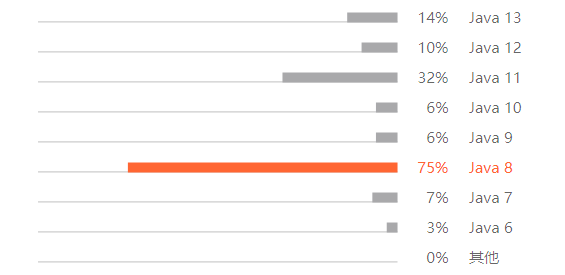

## 1、Java 8

2014 年 3 月 18 日，Oracle 发布了 Java 8，为目前唯二的 LTS（长期支持）版本之一，另一个是 Java 11，目前最新的版本为 Java 15

- Java 8 为目前使用最多的发行版本



*更多：[Java版本历史](https://zh.wikipedia.org/wiki/Java%E7%89%88%E6%9C%AC%E6%AD%B7%E5%8F%B2)、[Jetbrains Java编程](https://www.jetbrains.com/zh-cn/lp/devecosystem-2020/java/)*

## 2、接口默认实现与静态方法

Java 8 之后可以为接口方法提供一个默认实现，**用 default 修饰符来标记方法**，这样就可以只关心需要的方法，而不用去实现不需要的方法

- 在 JVM 中，接口的默认实现是非常高效的，并且通过字节码指令为方法调用提供了支持

```java
interface Animal {
    // 默认实现
    default void cao() {
        System.out.println("animal 艹");
    }

    void ri();
}

class Human implements Animal {
    // 默认方法可以不进行重写，非默认方法必须重写
    @Override
    public void ri() {
        System.out.println("human 日");
    }
}

public class Test {
    public static void main(String[] args) {
        Human human = new Human();
        // 不需要重写，直接调用默认方法
        human.cao();
        human.ri();
    }
}
```

### 2.1  默认方法冲突

如果在一个接口中定义了一个默认方法，又在超类或另一个接口中定义了同样的方法，就会产生冲突

- 超类优先：如果超类提供了一个具体方法，同名且有相同参数类型的默认方法会被忽略
- 接口冲突：如果一个接口提供了一个默认方法，另一个接口提供了一个同名而且参数类型（不论是否是默认参数）相同的方法，必须覆盖这个方法来解决冲突

```java
// 超类优先
interface Animal {
    default void cao() {
        System.out.println("animal 艹");
    }
}

class Mammal {
   public void cao() {
        System.out.println("mammal 艹");
    }
}

class Human extends Mammal implements Animal {}

public class Test {
    public static void main(String[] args) {
        Human human = new Human();
        human.cao();	// mammal 艹
    }
}
```

```java
// 接口冲突
interface Animal {
    default void cao() {
        System.out.println("animal 艹");
    }
}

interface Mammal {
    default void cao() {
        System.out.println("mammal 艹");
    }
}

class Human implements Mammal, Animal {
    // 必须重写方法
    @Override
    public void cao() {
        System.out.println("human 艹");
    }
}

public class Test {
    public static void main(String[] args) {
        Human human = new Human();
        human.cao();
    }
}
```

### 2.2  接口中的静态方法

```java
public class Test {
    public static void main(String[] args) {
        Animal.cao();
    }
}

interface Animal {
    // 必须要有方法体
    static void cao() {
        System.out.println("animal 艹");
    }
}
```

## 3、函数式接口

并不是所有的接口都可以使用 Lambda 表达式来实现，只有函数式接口才能写成 Lambda 表达式

- 函数式接口：**要求接口中定义的必须要实现的抽象方法只能有一个**

```java
// 该注解修饰函数式接口，即意味着接口中的抽象方法只能有一个，否则编译器会报错
// default方法和静态方法不会造成任何影响
@FunctionalInterface
interface Animal {
    void cao();
    
    default void ri() {
        System.out.println("日");
    }

    static void shit() {
        System.out.println("shit");
    }
}
```

## 4、Lambda 表达式

Lambda 表达式是 Java 8 添加的一个新特性，可以认为 Lambda 是一个匿名函数（相似于匿名内部类），作用是返回一个实现了接口的对象

- Lambda 表达式是一个匿名函数，主要关注方法的参数列表和方法体
  - `()`：描述参数列表
  - `{}`：描述方法体
  - `->`：Lambda 运算符，读作 `goes to`

```java
// 无参无返回接口
@FunctionalInterface
interface 无参无返 {
    void test();
}

// 单参无返回值接口
@FunctionalInterface
interface 单参无返 {
    void test(int i);
}

// 多参无返回值接口
@FunctionalInterface
interface 多参无返 {
    void test(int a, int b);
}

// 无参有返回值接口
@FunctionalInterface
interface 无参有返 {
    int test();
}

// 单参有返回值接口
@FunctionalInterface
interface 单参有返 {
    int test(int i);
}

// 多参有返回值接口
@FunctionalInterface
interface 多参有返 {
    int test(int a, int b);
}

public class Test {
    public static void main(String[] args) {
        无参无返 l1 = () -> {
            System.out.println("无参无返回值");
        };
        l1.test();

        单参无返 l2 = (int i) -> {
            System.out.println("单参无返回值");
        };
        l2.test(2);

        多参无返 l3 = (int a, int b) -> {
            System.out.println("多参无返回值");
        };
        l3.test(3, 3);

        无参有返 l4 = () -> {
            System.out.println("无参有返回值");
            return 4;
        };
        int l4Result = l4.test();

        单参有返 l5 = (int i) -> {
            System.out.println("单参有返回值");
            return 5;
        };
        int l5Result = l5.test(5);

        多参有返 l6 = (int a, int b) -> {
            System.out.println("多参有返回值");
            return 6;
        };
        int l6Result = l6.test(6, 6);
    }
}
```

### 4.1  Lambda 表达式语法精简

#### 4.1.1  参数类型的省略

由于在接口中已经定义了参数，所以在 Lambda 表达式中参数的类型可以省略

- 如果省略参数的类型，则所有的参数的类型都要省略

```java
多参无返 l3 = (int a, int b) -> {
    System.out.println("多参无返回值");
};
// 省略参数类型
多参无返 l3 = (a, b) -> {
    System.out.println("多参无返回值");
};
```

#### 4.1.2  参数小括号的省略

如果参数列表中，**参数的个数有且只有一个**，那么小括号可以省略，且仍然可以省略参数的类型

```java
单参无返 l2 = (i) -> {
    System.out.println("单参无返回值");
};
// 省略小括号
单参无返 l2 = i -> {
    System.out.println("单参无返回值");
};
```

#### 4.1.3  方法体大括号的省略

如果方法体只有一条语句，那么此时大括号可以省略

```java
单参无返 l2 = i -> {
    System.out.println("单参无返回值");
};
// 省略大括号
单参无返 l2 = i -> System.out.println("单参无返回值");
```

#### 4.1.4  return 的省略

如果方法体 **只有一条语句，且是返回语句**，可以省略 return，**且必须要省略大括号**

```java
单参有返 l5 = i -> {
    return 5;
};

单参有返 l5 = i -> 5;
```

### 4.2  方法引用

方法引用是 Lambda 表达式一种简写的方式，提供了一种引用而不执行方法的方式，用来直接访问类或者实例的已经存在的方法或者构造方法。使用时方法引用会创建函数式接口的一个实例

- **返回值的类型和参数列表要与接口中定义的一致**

```java
public class Test {
    public static void main(String[] args) {
        // 每次使用都实现相同的方法，则非常冗余
        单参有返 l1 = i -> i * 2;
        单参有返 l2 = i -> i * 2;
        
        // 一般的方法调用：将Lambda表达式的实现指向change方法
        单参有返 l3 = i -> Method.change(i);
        单参有返 l4 = i -> new Method().change2(i);
        
        // 方法引用：引用方法隶属者的change方法
        // 方法隶属者：静态方法隶属者为类，非静态方法的隶属者是对象
        单参有返 l5 = Method::change;
        单参有返 l6 = new Method()::change2;
    }
}

class Method {
    static int change(int i) {
        return i * 2;
    }

    int change2(int i) {
        return i * 2;
    }
}
```

#### 4.2.1  构造方法的引用 `类名::new`

```java
public class Test {
    public static void main(String[] args) {
        // 无参构造方法调用
        HumanCreate1 hc1 = () -> new Human();
        hc1.getHuman();
        // 无参构造方法引用
        HumanCreate1 hc1$ = Human::new;
        hc1$.getHuman();

        // 有参构造方法调用
        HumanCreate2 hc2 = (String name, int age) -> new Human(name, age);
        hc2.getHuman("特朗普", 18);
        // 有参构造方法引用
        HumanCreate2 hc2$ = Human::new;
        hc2$.getHuman("特朗普", 18);
    }
}

class Human {
    String name;
    int age;

    Human() {
        System.out.println("无参");
    }

    public Human(String name, int age) {
        this.name = name;
        this.age = age;
        System.out.println("有参");
    }
}

interface HumanCreate1 {
    Human getHuman();
}

interface HumanCreate2 {
    Human getHuman(String name, int age);
}
```

*更多：[Java-Lambda表达式和“方法引用”的对比和详解](https://blog.csdn.net/li_xunhuan/article/details/97930596)*

## 5、扩展注解

Java 8 扩展了注解的上下文。现在几乎可以在任何地方添加注解

```java
public @Deprecated class Test {

    @Retention( RetentionPolicy.RUNTIME )
    @Target( { ElementType.TYPE_USE, ElementType.TYPE_PARAMETER } )
    public @interface NonEmpty {
    }

    public @Deprecated void show() {}

    private void say(@NonEmpty String s) {}

    void see() throws @NonEmpty Exception {

        List<@NonEmpty String> list = new @NonEmpty ArrayList<>();

        throw new @NonEmpty Exception();
    }
}
```

## 6、重复注解

Java 8 引入了重复注解机制，在之前使用相同的注解在同一位置只能声明一次，不能声明多次

- 重复注解机制本身必须用 `@Repeatable` 注解。其实底层原理并没有改变，更多的是编译器的技巧

```java
public class Test {
    @Target(ElementType.TYPE)
    @Retention(RetentionPolicy.RUNTIME)
    public @interface Filters {
        Filter[] value();
    }

    @Target(ElementType.TYPE)
    @Retention(RetentionPolicy.RUNTIME)
    // 重复注解
    @Repeatable(Filters.class)
    public @interface Filter {
        String value();
    }

    @Filter("filter1")
    @Filter("filter2")
    class filter {}
}
```

更多：[Java 8新特性终极指南](https://wizardforcel.gitbooks.io/java8-tutorials/content/Java%208%20%E6%96%B0%E7%89%B9%E6%80%A7%E7%BB%88%E6%9E%81%E6%8C%87%E5%8D%97.html)

## 7、Optional

Java 8 为了解决 Null 值判断问题，受到 Google Guava 的启发，引入了 Optional 类库，可以避免显式的 Null 值判断

- Optional 实际上是个容器，可以包裹 Null 或非 Null 的对象

### 7.1  创建 Optional 对象

```java
// 1、创建一个空的Optional对象
Optional<String> op1 = Optional.empty();

// 2、创建一个对象不可为null的Optional对象，否则报空指针错误
Optional<String> op2 = Optional.of("Fuck");

// 3、创建一个对象可以为null的Optional对象
Optional<String> op3 = Optional.ofNullable(null);
```

### 7.2  常用方法

```java
public class Test {
    public static void main(String[] args) {
        Person person = new Person("特朗普");

        // get：返回对象值，如果对象为null则抛出异常
        Person op1 = Optional.of(person).get();
        System.out.println("Optional: " + Optional.of(person));
        System.out.println("get: " + op1);

        // isPresent：判断对象是否为空，如果对象为null则抛出异常
        boolean op2 = Optional.of(person).isPresent();
        System.out.println("isPresent: " + op2);

        // ifPresent：如果对象不为空，则执行Lambda表达式，否则不做任何处理，没有返回值
        Optional.of(person).ifPresent(p -> System.out.println("ifPresent: " + p.name));

        // filter：如果对象值存在并且满足条件，则返回满足条件的Optional，否则返回empty
        Optional<Person> op3 = Optional.of(person).filter(p -> p.name.length() > 0);
        System.out.println("filter: " + op3);

        // map：如果对象值存在则对其进行提取或转换值，若结果不为空则返回Optional，否则返回empty
        Optional<String> op4 = Optional.of(person).map(p -> "hello " + p.name);
        System.out.println("map: " + op4);

        // flatMap：功能类似map，需要先封装成Optional
        Optional<String> op5 = Optional.of(person).flatMap(p -> Optional.of(p.name));
        System.out.println("flatMap: " + op5);

        // orElse：如果对象值存在则返回对象值，否则返回传入的值（默认值）
        Person op6 = Optional.of(person).orElse(new Person("安倍晋三"));
        System.out.println("orElse: " + op6);

        // orElseGet：功能类似orElse，可以使用Lambda表达式
        Person op7 = Optional.of(person).orElseGet(() -> new Person("安倍晋三"));
        System.out.println("orElseGet: " + op7);
    }
}

class Person {
    String name;

    public Person(String name) {
        this.name = name;
    }

    @Override
    public String toString() {
        return "name=" + name;
    }
}
```

> Optional: Optional[name=特朗普]
> get: name=特朗普
> isPresent: true
> ifPresent: 特朗普
> filter: Optional[name=特朗普]
> map: Optional[hello 特朗普]
> flatMap: Optional[特朗普]
> orElse: name=特朗普
> orElseGet: name=特朗普

*更多：[理解、学习与使用 Java 中的 Optional](https://www.oschina.net/translate/understanding-accepting-and-leveraging-optional-in?lang=chs&p=1)*

## 8、Stream

Java 8 引入 Stream 流，让开发者能够以声明的方式处理数据源

- Stream 操作分为中间操作或者最终操作两种
  - 终端操作会返回一个结果
  - 中间操作会返回一个 Stream 流

- Stream 的数据源只能 Collection 的子类，List 或者 Set，不支持 Map
- Stream 的操作可以串行执行（Stream）或者并行执行（parallelStream）

### 8.1  常用方法

```java
public class Test {
    public static void main(String[] args) {
        List<String> list = getList();

        // forEach：循环遍历，没有返回值
        list.stream().forEach(s -> System.out.print(s + " "));

        // filter：过滤，返回符合条件的结果
        Stream<String> st1 = list.stream().filter(s -> s.length() > 2);

        // sorted：排序，可以传入Comparator进行自定义排序
        Stream<String> st2 = list.stream().sorted();

        // map：中间操作，将集合中的所有元素进行处理
        Stream<Integer> st3 =  list.stream().map(String::length);

        // 匹配
        // anyMatch：任意一个元素符合条件
        boolean anyMatch = list.stream().anyMatch(s -> s.length() == 3);
        // allMatch：全部都符合该条件
        boolean allMatch = list.stream().allMatch(s -> s.length() > 0);
        // noneMatch：全部都不符合该条件
        boolean noneMatch = list.stream().noneMatch(s -> s.length() > 4);

        // count：计数
        long count = list.stream().count();

        // reduce：将集合合并为一个值
        Optional<String> optional = list.stream().reduce((s1, s2) -> s1 + " / " + s2);

        // distinct：去重
        list.stream().distinct();

        // limit：返回前n个元素
        list.stream().limit(3);

        // collect：集合转换
        // 转Set
        Set<String> set = list.stream().collect(Collectors.toSet());
        // 转List
        List<String> strs = list.stream().collect(Collectors.toList());
        // 转Map
        Map<String, Integer> map = list.stream().collect(Collectors.toMap(Function.identity(),String::length));
        
        // Arrays.stream(T[] array)：数组转Stream
        Stream<String> st4 = Arrays.stream(new String[]{"one", "two"});
    }

    static List<String> getList() {
        List<String> list = new ArrayList<>();
        list.add("特朗普");
        list.add("默克尔");
        list.add("莫迪");
        list.add("马克龙");
        list.add("文在寅");
        list.add("普京");
        list.add("约翰逊");
        list.add("安倍晋三");
        return list;
    }
}
```

*更多：[【java8新特性】Stream API详解](https://www.jianshu.com/p/2b40fd0765c3)*

### 8.2  并行流

Stream 流支持串行和并行的。串行流操作是单线程操作，并行流是多线程操作，能够充分利用物理机多核 CPU  的优势，同时处理速度更快

```java
// 使用并行流很简单，将stream改为parallelStream即可
public class Test {
    public static void main(String[] args) {
        List<String> list = new ArrayList<>();
        for (int i = 0; i < 5000000; i++) {
            UUID uuid = UUID.randomUUID();
            list.add(uuid.toString());
        }

        long beforeStream = System.currentTimeMillis();
        System.out.println(list.stream().sorted().count());
        System.out.println(System.currentTimeMillis() - beforeStream);

        long beforeParallelStream = System.currentTimeMillis();
        System.out.println(list.parallelStream().sorted().count());
        System.out.println(System.currentTimeMillis() - beforeParallelStream);
    }
}
```

> 5000000
> 4849
> 5000000
> 2188

- 可以看出，并行流的效率比串行流快了一倍左右

## 9、Date API

新的 Date API 除了是不可变类，线程安全之外，还多了添加和优化了许多方法，但原有的时间处理方法已经能解决大部分问题，除非考虑线程安全的因素，原有的时间 API 已经足够使用了。另外新的 Date API 用法简单，使用时百度即可，不做赘述，附上一个写的不错的文章

*更多：[Java 8 新的日期时间 API](https://github.com/biezhi/learn-java8/blob/master/java8-datetime-api/README.md)*


