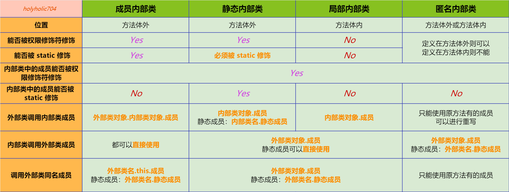

## 1、内部类

内部类是定义在一个类的内部的类，内部类 **不能定义静态变量和方法**。接口内也可以使用内部类，但没必要

* 更好的实现隐藏：内部类可以被 private 与 protected 修饰
* **内部类拥有外部类的所有元素的访问权限**：可以直接调用所有外部类的成员，包括 private 修饰的变量和方法、非静态变量和方法等
* 可以间接的实现多重继承：**一个类中可以写多个内部类，分别继承不同的类**
* 可以避免实现的接口或继承的类中有同名的方法
* 当想要定义一个回调函数且不想编写大量代码时，使用匿名内部类比较便捷

### 1.1  内部类区别



### 1.2  成员内部类

```java
public class Test {
    public int x = 1;
    private static int y = 10;
    String str = "Test";

    public void m1() {
        System.out.println("Test m1");
    }

    private static void m2() {
        System.out.println("Test m2");
    }

    void str() {
        System.out.println("Test str");
    }

    // 成员内部类
    class InnerClass {
        String str = "InnerClass";

        void method() {
            // 外部类成员变量
            System.out.println(x);
            // 外部类静态变量
            System.out.println(y);
            // 同名变量，优先调用内部类变量
            System.out.println(str);
            // 外部类同名变量
            System.out.println(Test.this.str);
            // 外部类方法
            m1();
            // 外部类静态方法
            m2();
            // 同名方法，优先调用内部类方法
            str();
            // 外部类同名方法
            Test.this.str();
        }

        void str() {
            System.out.println("InnerClass str");
        }
    }

    public static void main(String[] args) {
        // 先创建外部类对象
        Test test = new Test();
        // 通过外部类对象创建内部类对象
        Test.InnerClass inner = test.new InnerClass();
        // 调用内部类方法
        inner.method();
        // 调用内部类成员变量
        System.out.println(inner.str);
    }
}
```

### 1.3  静态内部类

被 static 修饰的成员内部类，不需要依赖于外部类的，可以看做静态变量，不能直接使用外部类的非静态变量或方法

```java
public class Test {
    public int x = 1;
    private static int y = 10;
    String str = "Test";

    public void m1() {
        System.out.println("Test m1");
    }

    private static void m2() {
        System.out.println("Test m2");
    }

    void str() {
        System.out.println("Test str");
    }

    static class InnerClass {
        private String str = "InnerClass";
        static int i = 10;

        void method() {
            // 外部类成员变量
            System.out.println(new Test().x);
            // 外部类静态变量
            System.out.println(y);
            // 同名变量，优先调用内部类变量
            System.out.println(str);
            // 外部类同名变量
            System.out.println(new Test().str);
            // 外部类方法
            new Test().m1();
            // 外部类静态方法
            m2();
            // 同名方法，优先调用内部类方法
            str();
            // 外部类同名方法
            new Test().str();
        }

        static void staticMethod() {
            // 同名变量，优先调用内部类变量
            System.out.println(new InnerClass().str);
            // 外部类同名变量
            System.out.println(new Test().str);
            // 同名方法，优先调用内部类方法
            new InnerClass().str();
            // 外部类同名方法
            new Test().str();
        }

        void str() {
            System.out.println("InnerClass str");
        }
    }

    public static void main(String[] args) {
        // 与成员内部类相比，无需创建外部类对象
        InnerClass inner = new InnerClass();
        // 调用内部类方法
        inner.method();
        // 调用内部类静态方法
        InnerClass.staticMethod();
        // 调用内部类成员变量
        System.out.println(inner.str);
        // 调用内部类静态成员变量
        System.out.println(InnerClass.i);
    }
}
```

### 1.4  局部内部类

```java
public class Test {
    public int x = 1;
    private static int y = 10;
    String str = "Test";

    public void m1() {
        System.out.println("Test m1");
    }

    private static void m2() {
        System.out.println("Test m2");
    }

    void str() {
        System.out.println("Test str");
    }

    public static void main(String[] args) {
        class InnerClass {
            private String str = "InnerClass";

            void method() {
                // 外部类成员变量
                System.out.println(new Test().x);
                // 外部类静态变量
                System.out.println(y);
                // 同名变量，优先调用内部类变量
                System.out.println(str);
                // 外部类同名变量
                System.out.println(new Test().str);
                // 外部类方法
                new Test().m1();
                // 外部类静态方法
                m2();
                // 同名方法，优先调用内部类方法
                str();
                // 外部类同名方法
                new Test().str();
            }

            void str() {
                System.out.println("InnerClass str");
            }
        }
        // 创建内部类对象
        InnerClass inner = new InnerClass();
        // 调用内部类方法
        inner.method();
        // 调用内部类成员变量
        System.out.println(inner.str);
    }
}
```

### 1.5  匿名内部类

没有名称的类，利用父类的构造函数和自身类体构造成一个类，其他地方不能引用，**没有构造器，不能实例化，只能使用一次**

```java
public class Test {
    int i = 10;

    One o1 = new One() {
        int i = 1;

        @Override
        void show() {
            System.out.println("o1 show");
        }
    };

    void say() {
        System.out.println("Test say");
    }

    public static void main(String[] args) {
        One o2 = new One() {
            @Override
            void show() {
                System.out.println("o2 show");
            }

            void say() {
                System.out.println("o2 say");
            }
        };
        // 定义在方法体外，则需要创建外部类对象
        Test test = new Test();
        // 调用内部类方法，o1重写后的方法
        test.o1.show(); // o1 show
        // 调用内部类成员变量
        System.out.println(test.o1.i);  // 0

        // 定义在方法体内，可以直接使用
        o2.show();	// o2 show
        // 只能调用One中包含的方法及变量
        o2.say();   // 编译错误
    }
}

class One {
    int i = 0;
    void show() {
        System.out.println("one show");
    }
}
```

### 1.6 小伙汁，你见过内部内部内部内部内部内部类吗

```java
public class Test {

    class InnerClass {
        class InnerInnerClass {
            class InnerInnerInnerClass {
                class InnerInnerInnerInnerClass {
                    class InnerInnerInnerInnerInnerClass {
                        class InnerInnerInnerInnerInnerInnerClass {
                            void show() {
                                System.out.println("内部内部内部内部内部内部类");
                            }
                        }
                    }
                }
            }
        }
    }


    public static void main(String[] args) {
        Test test = new Test();
        Test.InnerClass.InnerInnerClass.InnerInnerInnerClass.InnerInnerInnerInnerClass.InnerInnerInnerInnerInnerClass.InnerInnerInnerInnerInnerInnerClass inner = test.new InnerClass().new InnerInnerClass().new InnerInnerInnerClass().new InnerInnerInnerInnerClass().new InnerInnerInnerInnerInnerClass().new InnerInnerInnerInnerInnerInnerClass();
        inner.show();
    }
}
```