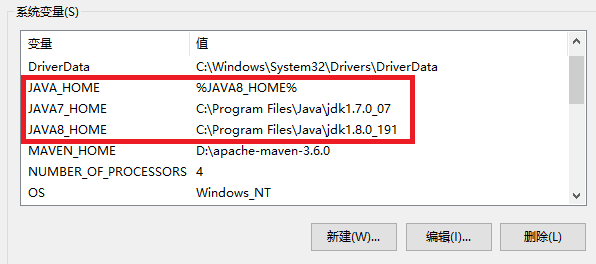
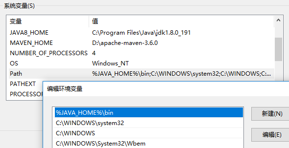

## 1、简介

### 1.1  感谢上帝赐予我们饭碗


### 1.2  Java 特点

简单性、面向对象、分布式、健壮性、安全性、体系结构中立、可移植性、解释型、高性能、多线程、动态性

| 术语                     | 缩写 |                       说明                        |
| :----------------------- | :--: | :-----------------------------------------------: |
| Java Development Kit     | JDK  | Java 开发工具包，提供了 Java 的开发环境和运行环境 |
| Java Runtime Environment | JRE  |    Java 运行环境，为 Java 的运行提供了所需环境    |
| Standard Edition         |  SE  |   标准版，用于桌面或简单服务器应用的 Java 平台    |
| Enterprise Edition       |  EE  |      企业版，用于复杂服务器应用的 Java 平台       |

### 1.3  Java 跨平台原理（Write Once，Run Everywhere）

Java 程序是在 JVM 上运行的，不是直接在电脑上运行的，Java 代码首先被编译成字节码文件（`.class`），**字节码不能直接运行，必须通过 JVM 翻译成机器码才能运行**

在 Java 中有第一次编译，还有第二次解释来适应不同平台，根据不同的平台进行解释执行。**翻译一句，执行一句**，翻译过程如果不出现错误，就一直进行到完毕，否则将在错误处停止执行

- 不同平台（Windows、Linux 等）下编译生成的字节码是一样的，但由 JVM 翻译成的机器码却不一样
- JVM 是一个软件，用 C/C++ 开发，不同的平台有不同的版本，**跨平台的是 Java 程序，不是 JVM**。即使将 Java 程序打包成可执行文件，**仍然需要 JVM 的支持**


*更多：[Java跨平台原理及Java的安全性](https://segmentfault.com/a/1190000022865032)*

### 1.4  环境配置与版本切换





```bash
# 检查是否安装成功
java -version
```

## 2、数据类型

Java 语言是强类型语言，意味着必须为每一个变量声明一种类型。不同的数据类型，在内存中分配了不同的内存空间。在定义变量的时候，声明变量的数据类型，就会为变量 **合理的分配内存空间，避免空间浪费**

- 基本类型：**保存在栈内存中的简单数据段**
- 引用类型：**保存在堆内存中的对象**

*更多：[Java基本数据类型和引用类型](https://zhuanlan.zhihu.com/p/28654272)*

### 2.1  数据存储

| 存储位置                           | 简介                                                         | 备注                                                         |
| :--------------------------------- | ------------------------------------------------------------ | ------------------------------------------------------------ |
| **寄存器（Registers）**            | 最快的存储区域，位于 CPU 内部。但寄存器的数量十分有限，所以需要根据需求进行分配 | 我们对其没有直接的控制权，也无法在自己的程序里找到寄存器存在的踪迹 |
| **栈内存（Stack）**                | 存在于常规内存 RAM（随机访问存储器）区域中，可通过栈指针获得处理器的直接支持。**栈指针下移分配内存，上移释放内存**。这是一种 **仅次于寄存器的非常快速有效的分配存储方式** | 创建程序时，Java 系统必须知道栈内保存的所有项的生命周期。这种约束限制了程序的灵活性。因此，虽然在栈内存上存在一些 Java 数据（如对象引用），但 Java 对象本身的数据却是保存在堆内存的 |
| **堆内存（Heap）**                 | 存在于常规内存 RAM 区域中，是一种通用的内存池，**所有 Java 对象都存在于其中**。与栈内存不同，编译器不需要知道对象必须在堆内存上停留多长时间。因此，**用堆内存保存数据更具灵活性** | 这种灵活性是有代价的：分配和清理堆内存要比栈内存需要更多的时间。但 Java 的堆内存分配机制现在已经非常快，因此这不是一个值得关心的问题了 |
| **常量存储（Constant storage）**   | 常量值通常直接放在程序代码中，因为它们永远不会改变。如需严格保护，可考虑将置于只读存储器 ROM（只读存储器）中 |                                                              |
| **非 RAM 存储（Non-RAM storage）** | 数据完全存在于程序之外，在程序未运行以及脱离程序控制后依然存在。两个主要的例子：**序列化对象**、**持久化对象** | 将对象转存于另一个介质中，并在需要时恢复成常规的、基于 RAM 的对象。Java 为轻量级持久化提供了支持。而诸如 JDBC 这些类库为使用数据库存储和检索对象信息提供了更复杂的支持 |

### 2.2  基本数据类型（primitive type）

|   数据类型   | 关键字  | 存储需求 |               取值范围                | 默认值 |  包装类   |
| :----------: | :-----: | :------: | :-----------------------------------: | :----: | :-------: |
|    字节型    |  byte   |    1     |              -128 ~ 127               |   0    |   Byte    |
|    短整型    |  short  |    2     |  -2<sup>15</sup> ~ 2<sup>15</sup> -1  |   0    |   Short   |
|     整型     |   int   |    4     |  -2<sup>31</sup> ~ 2<sup>31</sup> -1  |   0    |  Integer  |
|    长整型    |  long   |    8     |  -2<sup>63</sup> ~ 2<sup>63</sup> -1  |   0    |   Long    |
| 单精度浮点型 |  float  |    4     |                IEEE754                |  0.0   |   Float   |
| 双精度浮点型 | double  |    8     |                IEEE754                |  0.0   |  Double   |
|    字符型    |  char   |    2     | Unicode 0 ~ Unicode 2<sup>16</sup> -1 | \u0000 | Character |
|    布尔型    | boolean |    1     |              true、false              | false  |  Boolean  |

```java
// long类型后缀：l 或 L
long l1 = 1l;
long l2 = 1L;

// float类型后缀：f 或 F
float f1 = 0.1f;
float f2 = 0.1F;

// double类型后缀：d 或 D
double d1 = 0.1d;
double d2 = 0.1D;

// 二进制前缀：0b 或 0B
int i1 = 0b1011;
int i2 = 0B1011;

// 十六进制前缀：0x 或 0X
int x1 = 0x99f;
int x2 = 0X99F;
```

- **浮点型没有后缀的话，默认为 double 类型**
- 不建议用浮点型表示金额，因为计算机中保存的小数其实是十进制的小数的近似值，并不是准确值
  - 建议使用 BigDecimal 或者 Long（单位为分）来表示金额
- 可以为数字字面量加下划线，只是为了更易读，Java 编译器会去除这些下划线
  - `int i = 1_000_000`
- char 类型的字面量值要用单引号括起来，用来存储 Unicode 编码的字符
  - 因为 Unicode 编码字符集中也包含了汉字，所以 **char 类型可以存储一个汉字**
  - Unicode 类编码占用 2 个字节，所以 char 类型的变量也是占用 2 个字节
- **多种数据类型做混合运算，先转换成容量最大的那种再做运算**
  - 八大基本数据类型，**除 boolean 类型之外都可以相互转换**
  - **byte、short、char 做混合运算的时候，会先转换成 int 再做运算**

```java
short s1 = 1;
short s2 = 2;

short s = s1 + s2;	// 报错，需用int类型接受，或强转成short类型
int s = s1 + s2;	// 正确编译，用int类型接受
short s = (short) (s1 + s2);	// 正确编译，强转成short类型
```

```java
short s = 1;
s = s + 1;	// 报错，由于s1+1运算时 会自动提升表达式的类型，所以结果是int型
s += 1;		// 正确编译，因为+=是Java语言规定的运算符，Java编译器会对它进行特殊处理
```

### 2.3  枚举类型

有时变量的取值只在一个有限的集合内，枚举类型包括有限个命名的值。所有的枚举类型都是 Enum 类的子类。在创建枚举时，编译器会自动创建 `toString()` 方法，以便显示某个枚举实例的名称。还会创建 `ordinal()` 方法表示某个特定枚举常量的声明顺序

```java
enum Color {
    red, black, white, green
}

public class Test {
    public static void main(String[] args) {
        // Color类型的变量只能存储这个类型声明中给定的某个枚举值，或者null值
        // null表示这个变量没有设置任何值
        // 返回枚举常量名
        Color.black;						// black
        // 返回序号
        Color.green.ordinal();				// 3
        // 返回一个包含全部枚举值的数组
        Color[] colors = Color.values();	// [red, black, white, green]
    }
}
```

### 2.4  参数传递

Java 中方法参数传递方式是 **按值传递**

- 基本类型：传递的是基本类型的 **字面量值的拷贝**，不改变其值
- 引用类型：传递的是该参数所引用的对象在堆中 **地址值的拷贝**，改变其值
  - String 类虽然是引用数据类型，但它做参数传递时和基本数据类型是一样的（我们中出了一个叛徒）

*更多：[Java 到底是值传递还是引用传递](https://www.zhihu.com/question/31203609)*

## 3、运算符

- **运算符存在优先级，在使用时应用括号明确规定运算顺序**

```java
// 整数被0除将会产生一个异常，而浮点数被0除将会得到无穷大或NaN结果
// ArithmeticException: / by zero
System.out.println(1/0);
// Infinity
System.out.println(1.0/0);
```

- `&&` 与 `&` 的区别

|                       `&&`                       |                   `&`                    |
| :----------------------------------------------: | :--------------------------------------: |
| 具有短路效果。如果左边结果是 false，则右边不执行 | 无论左边是 false 还是 true，右边都会执行 |

- `||` 与 `|` 的区别

|                      `||`                       |                   `|`                    |
| :---------------------------------------------: | :--------------------------------------: |
| 具有短路效果。如果左边结果是 true，则右边不执行 | 无论左边是 false 还是 true，右边都会执行 |

- `++n` 与 `n++` 的区别
  - 建议不要在表达式中使用 `++ `，因为这样的代码很容易让人闲惑 ， 而且会带来烦人的 bug

|             `++n`              |                    `n++`                     |
| :----------------------------: | :------------------------------------------: |
| 先完成加 1，然后再执行其他操作 | 先使用变量原来的值，执行完操作后，再进行加 1 |

- `^`：逻辑异或，两边只要是不一致就是 true
- `=`：赋值运算符
  - 基本类型，赋值运算符会直接改变变量的值，原来的值被覆盖掉
  - 引用类型，赋值运算符会改变引用中所保存的地址，原来的地址被覆盖掉。**但是原来的对象不会被改变**
- 移位运算符
  - `<<`：左移运算符，`num << 1`，相当于 num 乘以 2
  - `>>`：右移运算符，`num >> 1`，相当于 num 除以 2
  - `>>> `：无符号右移，忽略符号位，空位都以 0 补齐

```java
// 以下数据类型为int
 7：00000000000000000000000000000111
// -7的二进制为7的反码加上补码1，正数的原码、反码、补码相同
-7：11111111111111111111111111111001    // 末尾1表示-1，0表示-2

  7<<1：00000000000000000000000000001110		// 结果为14
  7>>1：00000000000000000000000000000011		// 结果为3
 -7<<1：11111111111111111111111111110010		// 结果为-14
 -7>>1：11111111111111111111111111111100		// 结果为-4
-7>>>1：01111111111111111111111111111100		// 结果为2147483644
```

- 三元运算符：`布尔表达式 : 值1 ? 值2`，表达式为 true，返回 `值1`，表达式为 false，返回 `值2`

- `==` 与 `equals()`
  - `==`：**基本数据类型比较的是值，引用数据类型比较的是内存地址**
  - `equals()`：如果被重写，则比较两个对象内容是否相等，否则，比较的是内存地址
  - String、Integer 等中的 equals 方法是被重写过的，因为 Object 的 equals 方法是比较的对象的内存地址，而 String 的 equals 方法比较的是对象的值

### 3.1  注释

```java
// 单行注释：只能注释一行内容，用在注释信息内容少的地方

/* 
   长注释：能注释很多行的内容
*/

/**
 * 文档注释：可以用来自动地生成文档，常用于类与方法注释
 */
```

## 4、控制流程

- switch 语句会从与选项值相匹配的 case 标签处开始执行，直到遇到 break 语句，或者执行到 switch 语句的结束处为止。如果没有相匹配的 case 标签，而有 default 子句，就执行这个子句
  - 条件括号中可以填写 byte、short、char、int 类型，即 **能够自动转换为 int 类型** 的都可以
  - 在 JDK7 之后可以填写 String 类型
  - **case 后面只能是常量**，不能是变量，**case 的值不能重复**

- while 循环本质上和 for 循环是一样的，可以相互替换，作用相同，建议使用 for 循环，因为变量会及早的从内存中消失，可以提高内存的使用效率
  - while 循环会首先检测循环条件，因此，循环体中的代码可能不会被执行，如果需要至少执行一次，可以使用 `do / while` 循环

- break、continue、return 区别
  - break：跳出一层循环，可以控制结束嵌套循环
  - continue：结束一趟循环，也可以像 break 那样加上循环的名字（goto）
  - return：它的作用不是结束循环的，而是结束方法

```java
out: for (int i = 0; i < 10; i++) {
    for (int j = 0; j < 10; j++) {
        break out;
    }
}
```

## 5、数组

数组是一种简单的数据结构，线性的结构，是相同数据类型的元素按一定顺序排列的集合。通过一个整型下标可以访问数组中的每一个值

- 数组和集合区分开的原因：效率，类型，保存基本数据类型的能力

### 5.1  初始化数组

数组初始化就是为数组开辟 **连续的内存空间**，并为每个数组元素赋予值。知道数组的首元素的内存地址，只要知道下标就可以快速的计算出偏移量，通过首元素内存地址加上偏移量可以快速计算出要查找元素的内存地址，通过内存地址快速定位该元素，所以数组查找元素的效率较高

- 数组是简单的线性序列，这使得对元素的访问变得非常快。然而代价就是数组对象的大小是固定的，且在该数组的生存期内不能更改

- 动态初始化数组，会先在堆内存中分配这个数组，并且数组中每一个元素都采用 **默认值**

```java
// 静态初始化
int[] arr = {1, 2, 3, 4, 5};
// 动态初始化
int[] arr = new int[5];
```

### 5.2  二维数组

```java
// {{0,0,0},{0,0,0}}
int[][] arr = new int[2][3];

// 遍历
for (int i = 0; i < arr.length; i++) {
    for (int j = 0; j < arr[i].length; j++) {
        System.out.print(arr[i][j]);
    }
}
```

### 5.3  常用方法

```java
// 返回一个List
Arrays.asList(数组);

// 排序，使用了优化的快速排序算法
Arrays.sort(数组);

// 二分法查找，返回下标
Arrays.binarySearch(数组, 需要查找的元素);

// 数组转字符串
Arrays.toString(数组);

// 填充数组
Arrays.fill(数组, 需要填充的元素);

// 复制数组
Arrays.copyOf(数组, 新数组的长度);

// 复制数组
Arrays.copyOfRange(数组, 起始下标, 结束下标);
```

## 6、万物皆对象


|                           面向过程                           |                           面向对象                           |
| :----------------------------------------------------------: | :----------------------------------------------------------: |
|  把问题分解成一个一个步骤，每个步骤用函数实现，依次调用即可  | 将问题分解成一个一个步骤，**把每个步骤抽象成对象**，通过不同对象之间的调用，组合解决问题 |
| 注重 **过程**，把问题分解成多个不同的步骤，然后把各个步骤变成方法，使用的时候依次调用 | 注重 **对象之间的交互**，将复杂的事情简单化，把问题分解成各个对象，然后各个对象之间进行交互，每个对象内部都进行了封装 |
| 性能比面向对象高，类调用时需要实例化，开销比较大，比较消耗资源 | 易维护、易复用、易扩展，由于面向对象有封装、继承、多态性的特性，可以设计出低耦合的系统，使系统更加灵活、更加易于维护 |

* 类：**具有相同属性和方法的一组对象的集合**，是构造对象的模板或蓝图

- 包：在类名前面使用关键字 package 加入包名来避免命名冲突问题，通常使用倒写的域名命名
  - package 语句只能出现在 Java 文件的第一行，且只能有一个
  - 如果没有 package，默认表示无包名
  - Java.lang 包下所有类不需要手动导入，系统自动导入，Object 类，String 类都在这个包里面
- 方法：为了完成某个任务，对象所能执行的操作，可以提高代码的复用性
  * 不要在两个方法里面互相调用，程序会报出 StackOverflowError 错误
  * 方法自己调用自己叫做递归，必须要有结束条件，否则将会造成 StackOverflowError 错误
- 对象：**系统中描述客观事物的一个实体**

## 7、面向对象三大特性

### 7.1  封装


把客观事物封装成抽象的类，**隐藏对象的属性和实现细节，仅对外提供公共访问方式**。不用关心具体实现，提高安全性，提高了代码的复用性，减少耦合

- 封装的使用
  - 将成员变量用 private 修饰，private 仅仅是封装的一种体现形式，**封装不是私有**
- 提供对应的 get 和 set 方法

### 7.2  继承


**子类自动共享父类数据结构和方法的机制**，是类之间的一种关系。在定义和实现一个类的时候，可以在一个已有的类的基础之上，加入若干新的内容。**Java 只支持单继承和多层继承**，子类可以继承父类中的 **非 private 修饰的成员方法和成员变量，构造方法不能被继承**

- 如果一个类没有显示的继承其他类，那么这个类会 **默认继承 Object 类**，Object 是 Java 中的根类

* 提高了代码的复用性、维护性
* 让类与类之间产生了关系，是多态的前提

* 增强了类之间的耦合，软件开发的一个原则是 **高内聚，低耦合**
  * 内聚：一个模块内各个元素彼此结合的紧密程度
  * 耦合：一个软件里面不同模块之间相互连接的数量

### 7.3  多态


**一种行为，多种状态**。同一操作作用于不同的对象，可以有不同的解释，产生不同的执行结果。**提高了程序的扩展性，降低了代码之间的耦合**

- 多态的实现
  - 有继承
  - 有方法重写
  - 有父类引用指向子类对象

* 动态绑定：在运行根据具体对象的类型进行绑定
* 静态绑定：在程序执行前已经被绑定

- 类型转换：子类向父类型进行转换，是 **自动类型转换**，也叫向上转型。父类向子类型转换，是 **强制类型转换**，也叫向下转型。如果有多个子类需要强转的话，需要先使用 `instanceof` 判断一下对象属于哪个子类

```java
public class Demo {
    public static void main(String[] args) {
        Father demo = new Son();
        demo.same();	// same son
        demo.differentFather();	// different father
        ((Son) demo).differentSon();	// different son
        System.out.println(demo.num);	// 111
        System.out.println(demo.fatherNum);	// 666
        System.out.println(((Son) demo).sonNum);	// 999
    }
}

class Father {
    public int num = 111;
    public int fatherNum = 666;

    public void same() {
        System.out.println("same father");
    }

    public void differentFather() {
        System.out.println("different father");
    }
}

class Son extends Father {
    public int num = 222;
    public int sonNum = 999;

    @Override
    public void same() {
        System.out.println("same son");
    }

    public void differentSon() {
        System.out.println("different son");
    }
}
```

## 8、创建对象的五种方法

```java
public class Test implements Cloneable, Serializable {
    // 1、new关键字
    public Test method01() {
        return new Test();
    }

    // 2、Class类的newInstance方法
    public Test method02() throws Exception {
        // 第一种写法，需填入类的全限定名
        Test test = (Test) Class.forName("com.test.Test").newInstance();
        // 第二种方法
        return Test.class.newInstance();
    }

    // 3、Constructor类的newInstance方法
    public Test method03() throws Exception {
        Constructor<Test> constructor = Test.class.getConstructor();
        return constructor.newInstance();
    }

    // 4、Clone方法
    public Test method04() throws Exception {
        return (Test) new Test().clone();
    }
	// 重写clone方法
    @Override
    protected Object clone() throws CloneNotSupportedException {
        return super.clone();
    }

    // 5、反序列化，需要先让类实现Serializable接口
    public Test method05() throws Exception {
        String file = "test";
        // 序列化
        Test test = new Test();
        ObjectOutputStream oos = new ObjectOutputStream(new FileOutputStream(file));
        oos.writeObject(test);
        oos.flush();
        // 反序列化
        ObjectInputStream ois = new ObjectInputStream(new FileInputStream(file));
        return (Test) ois.readObject();
    }
}
```

* 调用一个对象的 clone 方法，JVM 会创建一个新的对象，将之前对象的内容全部拷贝进去
  * **用 clone 方法创建对象不会调用任何构造方法**
* 当序列化和反序列化一个对象，JVM 会给我们创建一个单独的对象。在反序列化时，JVM 创建对象 **并不会调用任何构造方法**

### 8.1  两种 newInstance 方法的区别

|           Class 类的 newInstance           |              构造器类的 newInstance              |
| :----------------------------------------: | :----------------------------------------------: |
|       Class 类位于 Java 的 lang 包中       |         构造器类是 Java 反射机制的一部分         |
|    只能触发 **无参的构造方法** 创建对象    |   能触发 **无参的或有参的构造方法** 来创建对象   |
| 需要其构造方法是共有的或者对调用方法可见的 | 可以在特定环境下调用 **私有构造方法** 来创建对象 |
|            抛出类构造函数的异常            |    包装了一个 InvocationTargetException 异常     |

* Class 类本质上调用了反射包构造器类中无参数的 newInstance 方法，捕获了 InvocationTargetException，将构造器本身的异常抛出

*更多：[Java中创建对象的 5种方式](https://www.cnblogs.com/wxd0108/p/5685817.html)*

## 9、权限修饰符

可以限定其他类对该类、属性和方法的使用权限，**protected 和 private 不能用于修饰类**

- 如果使用 private 修饰类，那么这个类不能创建实例，这个类的属性和方法不能被访问，那么创建这个类毫无意义
- 如果使用 protected 修饰类，与该类不同包的类想要访问该类，就必须继承这个类，但前提是不同包的类能访问到这个类，这就产生了冲突

|  修饰符   | 同一个类 | 同一个包 | 子类 | 其他包 |
| :-------: | :------: | :------: | :--: | :----: |
|  public   |    〇    |    〇    |  〇  |   〇   |
| protected |    〇    |    〇    |  〇  |   X    |
|  default  |    〇    |    〇    |  X   |   X    |
|  private  |    〇    |    X     |  X   |   X    |

*更多：[Java的外部类为什么不能使用private、protected进行修饰](https://www.cnblogs.com/AleiCui/p/12792565.html)*

## 10、成员变量与局部变量

|                         成员变量                         |                 局部变量                 |
| :------------------------------------------------------: | :--------------------------------------: |
|                     写在方法体的外面                     |             写在方法体的里面             |
| 声明时可以不进行初始化值，**会自动以类型的默认值而赋值** |           声明时必须进行初始化           |
|             可以被本类或其他类的方法进行调用             |    只能在声明局部变量的方法内进行调用    |
|           可以被访问控制修饰符及 static 所修饰           | **不能被访问控制修饰符及 static 所修饰** |
|            存在于堆内存，随着对象的创建而存在            |  存在于栈内存，随着方法的调用而自动消失  |

## 11、构造方法

为对象数据进行初始化

* 方法名与类名相同，**不能被继承，因此不能被重写，但可以被重载**
* 没有返回值类型，不能使用 return 返回值，不能被 void 修饰
* 如果一个类没有提供任何构造方法，系统 **默认提供一个无参数构造方法**。如果一个类已经手动的提供了构造方法，那么系统不会再提供任何构造方法。如果需要使用无参构造方法，就必须显式的写出
* 在创建对象的时候会 **默认执行无参构造方法，构造方法不能手动调用**

### 11.1  创建对象的过程

1. 当首次创建 `Test` 类型的对象或是首次访问该类的静态方法或属性时，Java 解释器必须在类路径中查找，以定位 `Test.class`
2. 当加载完 `Test.class` 后，将创建一个 `Class` 对象，有关静态初始化的所有动作都会执行。因此，静态初始化只会在首次加载 `Class` 对象时初始化一次
3. 当用 `new Test()` 创建对象时，首先会在堆上为 `Test` 对象分配足够的存储空间
4. 分配的存储空间首先会被清零，即会将 `Test` 对象中的所有基本类型数据设置为默认值，引用被置为 `null`
5. 执行所有出现在字段定义处的初始化动作
6. 执行构造器

## 12、重载与重写

|                     方法重载（Overload）                     |                     方法重写（Override）                     |
| :----------------------------------------------------------: | :----------------------------------------------------------: |
|                       发生在同一个类中                       |                必须继承一个类或者实现一个接口                |
|  **方法名相同，参数列表不同，与方法返回值类型、修饰符无关**  |       必须具有 **相同的方法名、返回值类型和参数列表**        |
| **编译期绑定**，在编译时根据参数变量的类型判断应该调用哪个方法 | **运行期绑定**，在运行的时候，根据引用变量所指向的实际对象的类型来调用方法 |
|                              空                              | 重写的方法 **不能比被重写的方法拥有更低的访问权限，抛出更宽泛的异常** |
|                              空                              |                 私有方法、构造方法不能被重写                 |
|                              空                              |                     静态的方法不存在重写                     |
|                              空                              |              重写指的是成员方法，和成员变量无关              |

### 12.1  重载与基本类型

基本类型可以自动从较小的类型转型为较大的类型，当与重载结合时，会调用类型较大的那个方法

```java
public class Test {
    void method(short x) {
        System.out.println("short method");
    }

    void method(int x) {
        System.out.println("int method");
    }

    public static void main(String[] args) {
        Test test = new Test();
        test.method(1);		// 输出int method
    }
}
```

### 12.2  为什么不能根据返回类型来区分重载

因为调用时不能指定类型信息，编译器不知道你要调用哪个函数

```java
// 当执行method(1,2)时，无法确定调用哪个方法
String method(int a, int b);
double method(int a, int b);
```

### 12.3  为什么不能重写一个 private 方法

不能重写私有方法，因为 private 修饰的变量和方法只能在当前类中使用，其他的类访问是不到

### 12.4  为什么不能重写一个 static 方法

静态方法不能被重写，因为方法重写是基于运行时动态绑定的，而静态方法是编译时就静态绑定的。静态方法跟类的任何实例都不相关

## 13、包装类

在 Java 中，一切皆对象，但八大基本类型却不是对象。所以八大基本数据类型都有相应的包装类，包装类都在 `java.lang` 包里

- 可以在对象中定义更多的功能方法，方便对基本类型进行操作

* 集合不允许存放基本类型数据，只能存放引用类型数据

* 基本类型和包装类之间可以相互转换，即自动装箱与自动拆箱。使得在编程时能够更注重于业务的开发，而不是每转换一次就需要写一堆转换代码

* 有时候需要传递一个 Object 变量，所以不能传递基本数据类型，就可以使用包装类

|               包装类型               |          基本类型          |
| :----------------------------------: | :------------------------: |
|             传递内存地址             |           传递值           |
| **存放在堆中，通过对象的引用来调用** |  **栈内存中的简单数据段**  |
|          **初始值为 null**           | **初始值视具体的类型而定** |
|       需要用 new 关键字实例化        | 无需通过 new 关键字实例化  |

### 13.1  类型转换

```java
// int转Integer
Integer i1 = Integer.valueOf(10);
// int转String
String s1 = 10 + "";
```

```java
// Integer转String
String s2 = i1.toString();
// Integer转int
int i2 = i1.intValue();
```

```java
// String转Integer
Integer i4 = Integer.valueOf("10");
// String转int
int i3 = Integer.parseInt("10");
```

* 装箱：将基本类型用对应的引用类型包装起来，**通过包装类的 `valueOf()` 实现**

* 拆箱：将包装类型转换为基本数据类型，**通过包装类的 `xxxValue()` 实现**

### 13.2  int 与 Integer 的比较

```java
// false，生成两个对象，内存地址不同
Integer a = new Integer(10);
Integer b = new Integer(10);
System.out.println(a == b);		

// true，Integer变量和int变量比较时，会自动拆箱，变为两个int变量的比较
Integer a = new Integer(20);
int b = 20;
System.out.println(a == b);

// false，非new生成的Integer变量指向的是常量池中的对象，而使用new生成的变量指向堆中新建的对象
// 两者在内存中的地址不同
Integer a = new Integer(10);
Integer b = 10;
System.out.println(a == b);

// true，两个非new生成的Integer对象比较时，如果两个变量的值在区间-128到127之间，Java会进行缓存
// 除Integer外，Byte、Short、Long、Character、Boolean都支持缓存池
Integer a = 127;
Integer b = 127;
System.out.println(a==b);
// false
Integer a = 128;
Integer b = 128;
System.out.println(a == b);		
```

*更多：[java面试题之 int和 Integer的区别](https://www.cnblogs.com/guodongdidi/p/6953217.html)、[Integer的缓存机制](http://hollischuang.gitee.io/tobetopjavaer/#/basics/java-basic/integer-cache?id=integer的缓存机制)*

## 14、static

通常只有在使用 `new` 创建对象后，数据存储空间才被分配，对象的方法才能供外界调用。这种方式在两种情况下是不足的

- 有时只想为特定字段分配一个共享存储空间，而不去考虑究竟要创建多少对象，甚至根本就不创建对象
- 创建一个与此类的任何对象无关的方法。即使没有创建对象，也能调用该方法

```java
public class Test {
    static int a = 1;
    int b = 10;

    public static void main(String[] args) {
        Test t1 = new Test();
        Test t2 = new Test();

        t1.a++;

        System.out.println(t1.a);	// 2
        System.out.println(t2.a);	// 2

        t1.b++;
        System.out.println(t1.b);	// 11
        System.out.println(t2.b);	// 10
    }
}
```

* 修饰变量：程序运行时静态变量存放在方法区里面
* 修饰方法：**不用创建对象就能直接访问该方法**
  * 静态方法不能直接访问非静态的数据，静态方法不能使用 this 和 super
* 静态语句块：静态语句块在类加载阶段执行，**只执行一次**，并且是 **自上而下** 的顺序执行，**在构造方法之前执行**
* 被修饰的变量、方法、代码块都是属于 **类级别** 的，跟对象无关。可以通过 **`类名.静态方法名 `** 的方式访问

### 14.1  静态变量与实例变量

* 语法定义上的区别：静态变量前要加 static 关键字，而实例变量前则不加

* 程序运行时的区别
  * 实例变量属于某个对象的属性，必须创建了实例对象，其中的实例变量才会被分配空间，才能使用这个实例变量
  * 静态变量不属于某个实例对象，而是属于类，所以也称为类变量，只要程序加载了类的字节码，不用创建任何实例对象，静态变量就会被分配空间，静态变量就可以被使用了

### 14.2  为什么不能用静态方法调用非静态方法

非静态方法是要与对象关联在一起的，必须创建一个对象后，才可以在该对象上进行方法调用，而静态方法调用时不需要创建对象，可以直接调用

当一个静态方法被调用时，可能还没有创建任何实例对象，如果从一个静态方法中发出对非静态方法的调用，那个非静态方法是关联到哪个对象上的呢，这个逻辑无法成立

## 15、this 与 super

- this：代表着对当前对象的引用，在堆内存中的每个 Java 对象上都有一个 this 指向自己
  - 调用当前对象的非静态方法和数据
  - 可以区分成员变量和局部变量，使用 this 调用成员变量
  - 如果使用 this 调用构造方法的话，this **必须出现在构造方法的第一行**

- super：代表的是当前子类对象中的父类型特征
  - 调用父类非静态方法和数据

  - 子类调用父类中的构造方法时，需要使用 super。一个构造方法第一行如果没有 `this()`，也没有显式的去调用 `super()`，**系统会默认调用 `super()`**，如果已经有 this 了，那么就不会调用 super 了，**super 只能放在构造方法的第一行**。只是调用了父类中的构造方法，**并不会创建父类的对象**

### 15.1  Super 与 This 的区别

|           |   调用成员变量   |   调用构造方法   |   调用成员方法   |
| :-------: | :--------------: | :--------------: | :--------------: |
| **this**  | 调用本类成员变量 | 调用本类构造方法 | 调用本类成员方法 |
| **super** | 调用父类成员变量 | 调用父类构造方法 | 调用父类成员方法 |

## 16、final

|   修饰   | 说明                                                         |
| :------: | :----------------------------------------------------------- |
|    类    | 无法被继承                                                   |
|   方法   | 无法被重写                                                   |
| 局部变量 | 一旦赋值，不可再改变                                         |
| 成员变量 | 必须初始化值                                                 |
| 引用类型 | 该引用不可再重新指向其他的 Java 对象。但是 **地址值不能被改变，该引用指向的对象的属性值是可以修改的** |

```java
public final String str = "string";

public static void main(String[] args) {
	Test t = new Test();
    t.str = "another"; // 报错
    System.out.println(t.str + "append");// 可以运行，输出stringappend
}
```

### 16.1  final 方法

使用 final 方法的原因有两个

- **给方法上锁**，防止子类通过覆写改变方法的行为。这是出于继承的考虑，确保方法的行为不会因继承而改变

- **效率**。在早期的 Java 实现中，如果将一个方法指明为 final，就是同意编译器把对该方法的调用转化为内嵌调用。当编译器遇到 final 方法的调用时，就会很小心地跳过普通的插入代码以执行方法的调用机制（将参数压栈，跳至方法代码处执行，然后跳回并清理栈中的参数，最终处理返回值），而用方法体内实际代码的副本替代方法调用。这消除了方法调用的开销。但是如果一个方法很大代码膨胀，可能就看不到内嵌带来的性能提升，因为内嵌调用带来的性能提高被花费在方法里的时间抵消了
  - 在最近的 Java 版本中，虚拟机可以探测到这些情况，并优化去掉这些效率反而降低的内嵌调用方法。有很长一段时间，使用 final 来提高效率都被阻止。应该让编译器和 JVM 处理性能问题，**只有在为了明确禁止覆写方法时才使用 final**

### 16.2  final 参数

在参数列表中，将参数声明为 final 意味着在方法中不能改变参数指向的对象或基本变量

```java
int method(final int i) {
    return i;
}
```

## 17、抽象类与接口

|                            抽象类                            |                             接口                             |
| :----------------------------------------------------------: | :----------------------------------------------------------: |
|                   类的抽象，是一种模版设计                   |                  行为的抽象，是一种行为规范                  |
|            **有构造方法，可供非抽象子类创建对象**            |                         没有构造方法                         |
|         不一定包含抽象方法，有抽象方法的一定是抽象类         | **只能出现抽象方法，且必须被 `public abstract` 修饰，可省略不写** |
|                       可以有变量和常量                       | **只能出现常量，且必须被 `public static final` 修饰，可省略不写** |
| 只支持单继承，可以继承抽象类和非抽象类，**非抽象类必须重写父类的所有抽象方法** |             **接口间支持多继承，且只能继承接口**             |
|                         可以实现接口                         |                      不可以实现别的接口                      |

- 抽象类与接口都不能被实例化，都不能被 final 修饰
- 构造方法、被 static、final、private 修饰的方法不能声明为抽象方法

### 17.1  接口的优点

- 接口其实是一个特殊的抽象类，接口不是被类继承了，而是要被类实现
- 可以使项目分层，面向接口开发，提高开发效率
- 降低了代码之间的耦合度，提高了代码的可插拔性
- 开发中尽量使用接口，少用抽象类，一个类可以实现多个接口，却只能继承一个父类

### 17.2  默认方法

在 JDK1.8 之后可以为接口方法提供一个默认实现，**用 default 修饰符来标记方法**，这样一来就可以只关心需要的方法，而不用去实现不需要的方法

```java
interface Animal {
    // 默认实现
    default void cao() {
        System.out.println("animal 艹");
    }

    void ri();
}

class Human implements Animal {
    // 默认方法可以不进行重写，非默认方法必须重写
    @Override
    public void ri() {
        System.out.println("human 日");
    }
}

public class Test {
    public static void main(String[] args) {
        Human human = new Human();
        // 不需要重写，直接调用默认方法
        human.cao();
        human.ri();
    }
}
```

- 默认方法冲突：如果先在一个接口中将一个方法定义为默认方法，然后又在超类或另一个接口中定义了
  同样的方法，就会产生冲突
  - 超类优先：如果超类提供了一个具体方法，同名而且有相同参数类型的默认方法会被忽略
  - 接口冲突：如果一个超接口提供了一个默认方法，另一个接口提供了一个同名而且参数类型（不论是否是默认参数）相同的方法，必须覆盖这个方法来解决冲突

```java
// 超类优先
interface Animal {
    default void cao() {
        System.out.println("animal 艹");
    }
}

class Mammal {
   public void cao() {
        System.out.println("mammal 艹");
    }
}

class Human extends Mammal implements Animal {}

public class Test {
    public static void main(String[] args) {
        Human human = new Human();
        human.cao();	// mammal 艹
    }
}
```

```java
// 接口冲突
interface Animal {
    default void cao() {
        System.out.println("animal 艹");
    }
}

interface Mammal {
    default void cao() {
        System.out.println("mammal 艹");
    }
}

class Human implements Mammal, Animal {
    // 必须重写默认方法
    @Override
    public void cao() {
        System.out.println("human 艹");
    }
}

public class Test {
    public static void main(String[] args) {
        Human human = new Human();
        human.cao();
    }
}
```

## 18、代码块

使用 `{}` 括起来的代码被称为代码块

- 在方法中出现
  - 普通代码块：限定变量生命周期，及早释放，提高内存利用率
  - 同步代码块：被 synchronized 修饰，语句块会自动被加上内置锁，从而实现同步

- 在类中方法外出现
  - 构造代码块：每次调用构造方法都会执行，并且 **在构造方法前执行**
  - 静态代码块：被 static 修饰，**在类被加载的时候执行**，**且只执行一次**，常用来加载驱动

```java
public class Block {
    {
        System.out.println("构造代码块");
    }

    static {
        System.out.println("静态代码块");
    }

    public void method() {
        {
            System.out.println("普通代码块");
        }

        synchronized (this) {
            System.out.println("同步代码块");
        }
    }
}
```

### 18.1  执行顺序

```java
public class Father {
    {
        System.out.println("父类构造代码块");
    }

    static {
        System.out.println("父类静态代码块");
    }

    public void method() {
        {
            System.out.println("父类普通代码块");
        }

        synchronized (this) {
            System.out.println("父类同步代码块");
        }
    }
}

public class Son extends Father {
    {
        System.out.println("子类构造代码块");
    }

    static {
        System.out.println("子类静态代码块");
    }

    @Override
    public void method() {
        {
            System.out.println("子类普通代码块");
        }

        synchronized (this) {
            System.out.println("子类同步代码块");
        }
    }
}

public class Test {
    public static void main(String[] args) {
        Son son = new Son();
        son.method();
    }
}
// 父类静态代码块 -> 子类静态代码块 -> 父类构造代码块 -> 子类构造代码块
// -> 子类普通代码块 -> 子类同步代码块
```
