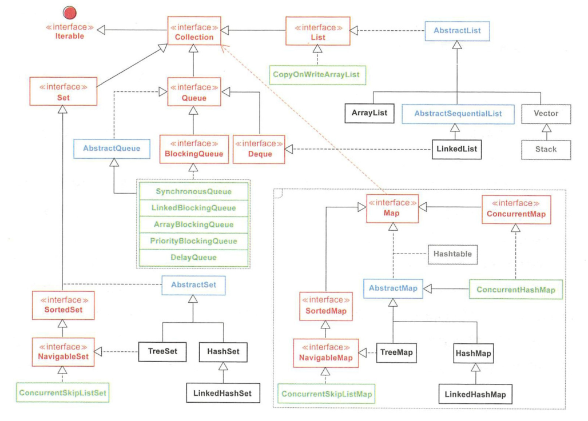
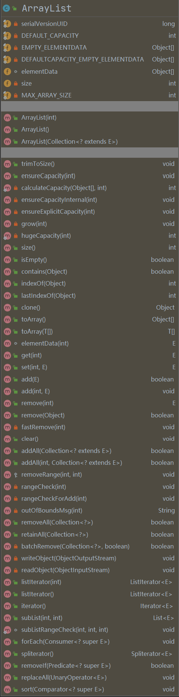

## 1、集合



## 2、Collection

Collection 接口是最基本的集合接口，不提供直接的实现。Collection 所代表的是一种规则，它所包含的元素都必须遵循一条或者多条规则，如是否允许重复、是否按照顺序插入

### 2.1  Collection 与 Collections 的区别

- Collection：是一个接口，是各种集合结构的父接口
- Collections：是一个工具类，包含有各种有关集合操作的静态方法

## 3、Iterator（迭代器）

Iterator 是一个接口，迭代器取代了集合框架中的 Enumeration，允许调用者在迭代过程中移除元素。它只有三个方法：`boolean hasNext()`、`T next()`、`void remove()`

- 在遍历集合的元素可以使用 Iterator，它的具体实现是 **以内部类的方式实现的**

### 3.1  Enumeration 与 Iterator 的区别

Enumeration 的速度是 Iterator 的两倍，也使用更少的内存。Enumeration 满足了基础的需要，但 Iterator 更加安全，因为当一个集合正在被遍历的时候，它会阻止其它线程去修改集合

- Iterator 允许调用者从集合中移除元素，而 Enumeration 不可以

## 4、数组与集合

数组是一种 **顺序表**，在各种高级语言中，它是组织和处理数据的一种常见方式，可以使用索引下标进行快速定位并获取指定位置的元素。在 Java 中，数组用以存储同一类型的对象，一旦分配内存后则无法扩容

### 4.1  数组和集合的区别

|                |                             数组                             |                             集合                             |
| :------------: | :----------------------------------------------------------: | :----------------------------------------------------------: |
|      长度      |                           长度固定                           |                 可以根据元素的增加而自动增长                 |
| 元素的数据类型 | 可以存储基本数据类型和引用数据类型，基本数据类型存储的是值，引用数据类型存储的是地址值 | 只能存储引用数据类型，如果存储基本数据类型时，会 **自动装箱** 变成相应的包装类 |
|    存储内容    |                      存储同一类型的元素                      |               可以存储不同类型的元素（不建议）               |

### 4.2  数组转集合

可以使用 `Arrays.asList` 方法进行数组转集合。该方法适用于对象型数据的数组，不建议使用于基本数据类型的数组

- 支持使用 set 方法修改元素的值，**原有数组相应位置的值同时也会被修改**，但是 **不能进行修改元素个数的任何操作**， 如 add、remove、clear 方法，否则均会抛出 `UnsupportedOperationException` 异常
- `Arrays.asList` 体现的是适配器模式，后台的数据仍是原有数组，set 方法间接地对数组进行值的修改操作

- asList 的 **返回对象是一个 Arrays 里的内部类**，它并没有实现集合个数的相关修改方法，这也正是抛出异常的原因

```java
public class Test {
    public static void main(String[] args) {
        List<Integer> list = Arrays.asList(getArray());
        // 修改元素值
        list.set(0, 999);
        // 报错
        list.add(123);
        list.forEach(System.out::println);
    }
    
    static Integer[] getArray() {
        Integer[] arr = new Integer[100];
        for (int i = 0; i < 100; i++) {
            arr[i] = i;
        }
        return arr;
    }
}

```

### 4.3  集合转数组

可以使用集合的 toArray 方法把集合转换成数组，数组长度要等于集合的长度，否则可能会输出 Null 值

```java
public class Test {
    public static void main(String[] args) {
        List<Integer> list = getList();
        Object[] arr = list.toArray();
        System.out.println(Arrays.toString(arr));
    }

    static List<Integer> getList() {
        List<Integer> list = new ArrayList<>();
        for (int i = 0; i < 100; i++) {
            list.add(i);
        }
        return list;
    }
}
```

## 5、List 接口

List 接口为 Collection 直接接口，是线性数据结构的主要实现。List 代表的是 **有序的 Collection**，里面的数据是有序可重复的

### 5.1  ArrayList

ArrayList 内部使用 **数组** 进行存储。**初始容量为 10**，该容量代表了数组的大小。当容器中的元素不断增加时，集合扩容时会创建更大的数组空间。所以 **最好指定一个初始容量值**，避免过多的进行扩容操作而浪费时间、效率

- ArrayList 擅长于随机访问，但插入和删除时速度通常很慢，因为可能需要移动其他元素

### 5.2  LinkedList

LinkedList 本质是 **双向链表**。除了有 ArrayList 的基本操作方法外，还提供了 get，remove，insert 方法操作首部或尾部。LinkedList 包含 3 个重要的成员：**size、first、last**。size 是双向链表中节点的个数，first 和 last 分别指向第一个和最后一个节点的引用。LinkedList 的优点在于 **可以将零散的内存单元通过附加引用的方式关联起来，形成按链路顺序查找的线性结构，内存利用率较高**

- LinkedList 除了继承 AbstractList 抽象类外，LinkedList 还实现了 **Deque 接口**，这个接口 **同时具有队列和栈的性质**

- LinkedList 的插入和删除速度很快，但是随机访问速度则很慢。因为所有的操作都是要按照双重链表的需要执行。**在列表中索引的操作将从开头或结尾遍历列表**（从靠近指定索引的一端）。这样做的好处就是可以通过较低的代价在 List 中进行插入和删除操作

- 与 ArrayList 一样，LinkedList 也是非同步的。如果多个线程同时访问一个 List，则必须自己实现访问同步。一种解决方法是在创建 List 时构造一个同步的 List：`List list = Collections.synchronizedList(new LinkedList(...))`

### 5.3  Vector

与 ArrayList 相似，但是 Vector 是同步的，即 Vector 是 **线程安全的动态数组**。它的操作与 ArrayList 几乎一样

### 5.4  Stack

**继承自 Vector**，实现一个 **后进先出的堆栈**，Stack 刚创建后是空栈。Stack 提供 5 个额外的方法使得 Vector 得以被当作堆栈使用。基本的 push 和 pop 方法，还有 peek 方法得到栈顶的元素，empty 方法测试堆栈是否为空，search 方法检测一个元素在堆栈中的位置

## 6、Queue 接口

Queue（队列）是一种先进先出的数据结构，队列是一种特殊的线性表，只允许在表的一端进行获取操作，在表的另一端进行插入操作，**可以存放重复的数据**。主要分为两大类

- 阻塞式队列：**队列满了以后再插入元素则会抛出异常**，主要包括 ArrayBlockQueue、PriorityBlockingQueue、LinkedBlockingQueue
- 双端队列：**支持在头、尾两端插入和移除元素**，主要包括：ArrayDeque、LinkedBlockingDeque、LinkedList

自从 BlockingQueue（阻塞队列）问世以来，队列的地位得到极大的提升，在各种高并发编程场景中，由于其本身 FIFO 的特性和阻塞操作的特点，经常被作为 Buffer（数据缓冲区）使用

## 7、Map 接口

Map 集合是以键值对作为存储元素实现的 **哈希结构**，**Key 按某种哈希函数计算后是唯一的，Value 则是可以重复的**。Map 没有继承 Collection，两个接口之间只是有依赖关系。最早用于存储键值对的 Hashtable 因为性能瓶颈已经被淘汰，而如今广泛使用的 HashMap，线程是不安全的。ConcurrentHashMap 是线程安全的，在 Java 8 中进行了锁的大幅度优化，体现出不错的性能。**在多线程并发场景中，优先推荐使用 ConcurrentHashMap**

- 可以使用 `keySet()` 查看所有的 Key，使用 `values()` 查看所有的 Value，使用 `entrySet()` 查看所有的键值对

### 7.1  HashMap

以哈希表数据结构实现，查找对象时通过哈希函数计算其位置，它是为快速查询而设计的，其内部定义了一个 hash 表数组（Entry[]），元素会通过 **哈希转换函数** 将元素的 **哈希地址转换成数组中存放的索引**，如果有冲突，则使用 **散列链表的形式将所有相同哈希地址的元素串起来**，可以通过查看 `HashMap.Entry` 的源码它是一个单链表结构

### 7.2  TreeMap

键以某种排序规则排序，内部以 **红黑树** 数据结构实现，实现了 SortedMap 接口

### 7.3  HashTable

以哈希表数据结构实现，解决冲突时与 HashMap 一样也是采用了散列链表的形式，但性能比 HashMap 要低

## 8、Set 接口

Set 是 **不允许出现重复元素** 的集合类型。Set 体系最常用的是 HashSet、TreeSet、LinkedHashSet。**它允许 Null 的存在但是仅有一个**

### 8.1  HashSet

HashSet 堪称 **查询速度最快的集合**，从源码分析是使用 **HashMap** 来实现的，只是 **Value 固定为一个静态对象，使用 Key 保证集合元素的唯一性，但它不保证集合元素的顺序**

### 8.2  TreeSet

从源码分析是使用 **TreeMap** 来实现的，**底层为树结构**，在添加新元素到集合中时，按照某种比较规则将其插入合适的位置，保证插入后的集合仍然是有序的

### 8.3  LinkedHashSet

继承自 HashSet，具有 HashSet 的优点，**内部使用链表维护了元素插入顺序**

## 9、集合间的异同

### 9.1  Vector、ArrayList 与 LinkedList

|              | ArrayList | LinkedList | Vector |
| :----------: | :-------: | :--------: | :----: |
| 底层数据结构 |   数组    |    链表    |  数组  |
|   线程安全   |  不安全   |   不安全   |  安全  |
|     查询     |    快     |     慢     |   快   |
|     增删     |    慢     |     快     |   慢   |
|     效率     |    高     |     高     |   低   |

### 9.2  HashSet、LinkedHashSet 与 TreeSet

- HashSet：**无序**，HashSet 中存放自定义类型对象时，一定要重写 hashCode 和 equals 方法
- LinkedHashSet：底层使用了链表的数据结构，特点是 **读取元素的顺序跟存入元素的顺序是一致的**
- TreeSet：特点是 **可以对存放进去的元素进行排序**

### 9.3  HashMap、HashTable 与 HashSet

- **实现接口不同**：HashMap、HashTable 是 Map 接口的实现类，而 HashSet 是 Set 接口的实现类，Set 接口是继承 Collection 接口
- **线程安全性，同步**：HashTable 中的方法加了同步锁（synchronized），所以对象是线程安全，而 HashMap 是异步的，所以存放的对象并不是线程安全的，而 HashSet 的底层是用 HashMap 实现的，所以它也不是线程安全的
- **执行效率**：HashTable 是同步的，而 HashMap 是异步的，所以 HashMap 的执行效率比 HashTable 要高，三者之间执行效率的排序是：HashMap > HashSet > HashTable
- **Key、Value 能否存放 Null**：HashMap 的 Key、Value 都可以为 Null，而 HashTable 是不能存放 Null，HashSet 存放的不是键值对，而是对象，也是可以为 Null
- **添加元素的方法不同**：HashMap 是通过 put 方法来增加元素的，而 HashSet 是通过 add 方法来增加元素的

### 9.4  HashMap 与 ConcurrentHashMap

ConcurrentHashMap 对整个桶数组进行了分割分段（Segment），然后在每一个分段上都用 lock 锁进行保护，相对于 HashTable 的 synchronized 锁的粒度更精细了一些，并发性能更好，而 HashMap 没有锁机制，不是线程安全的。JDK1.8 之后 ConcurrentHashMap 启用了一种全新的方式实现，利用 CAS 算法

- HashMap 的键值对允许有 Null，但是 ConCurrentHashMap 都不允许

## 10、ArrayList



### 10.1  ArrayList 中的属性

```java
// 默认初始容量大小
private static final int DEFAULT_CAPACITY = 10;

// 如果自定义容量为0，则会默认用它来初始化ArrayList。或者用于空数组替换
private static final Object[] EMPTY_ELEMENTDATA = {};

// 如果没有自定义容量，则会使用它来初始化ArrayList。或者用于空数组比对
private static final Object[] DEFAULTCAPACITY_EMPTY_ELEMENTDATA = {};

// 保存到ArrayList的元素
transient Object[] elementData;

// ArrayList实际大小
private int size;

// 最大数组的大小
private static final int MAX_ARRAY_SIZE = Integer.MAX_VALUE - 8;
```

#### 10.1.1  `EMPTY_ELEMENTDATA` 与 `DEFAULTCAPACITY_EMPTY_ELEMENTDATA`

- EMPTY_ELEMENTDATA：用在有参构造函数当初始容量为 0 时共享赋值用
- DEFAULTCAPACITY_EMPTY_ELEMENTDATA：用在无参构造函数赋值用

两者都是用来减少空数组的创建，所有空 ArrayList 都共享空数组。两者的区别主要是用来做区分用，针对有参无参的构造在扩容时做区分进行不同的扩容逻辑，优化性能

*更多：[java集合-ArrayList中EMPTY_ELEMENTDATA与DEFAULTCAPACITY_EMPTY_ELEMENTDATA的区别 ](https://www.cnblogs.com/zh-ch/p/12762619.html)*

### 10.2  构造方法

```java
// 指定初始容量的构造方法
public ArrayList(int initialCapacity) {
    if (initialCapacity > 0) {
        // 如果传入参数大于0，则创建initialCapacity大小的数组
        this.elementData = new Object[initialCapacity];
    } else if (initialCapacity == 0) {
        // 如果传入参数等于0，则指向一个空数组
        this.elementData = EMPTY_ELEMENTDATA;
    } else {
        throw new IllegalArgumentException("Illegal Capacity: " + initialCapacity);
    }
}

// 无参构造方法
public ArrayList() {
    this.elementData = DEFAULTCAPACITY_EMPTY_ELEMENTDATA;
}

// 构造一个包含指定集合的ArrayList
public ArrayList(Collection<? extends E> c) {
    // 将传入的集合转为数组
    elementData = c.toArray();
    if ((size = elementData.length) != 0) {
        // c.toArray可能返回的不是Object类型的数组
        if (elementData.getClass() != Object[].class) {
            // 将不为Object类型的elementData数组，复制到新的Object类型elementData数组
            elementData = Arrays.copyOf(elementData, size, Object[].class);
        }
    } else {
        // 如果传入的集合大小为0，则指向一个空数组
        this.elementData = EMPTY_ELEMENTDATA;
    }
}
```

### 10.3  添加元素

#### 10.3.1  添加元素到尾部

```java
// 将传入的元素插入到尾部
public boolean add(E e) {
    // 调用获得最小容量的方法
    ensureCapacityInternal(size + 1);
    elementData[size++] = e;
    return true;
}

// 获得最小容量
private void ensureCapacityInternal(int minCapacity) {
    // 先计算容量，再判断是否需要扩容
    ensureExplicitCapacity(calculateCapacity(elementData, minCapacity));
}

// 判断是否需要扩容
private void ensureExplicitCapacity(int minCapacity) {
    // 继承于AbstractList，记录着集合的修改次数
    modCount++;

    // 当所需最小容量大于elementData数组的长度，则进行扩容
    if (minCapacity - elementData.length > 0) {
        grow(minCapacity);
    }
}

// 计算容量
private static int calculateCapacity(Object[] elementData, int minCapacity) {
    // 如果传入的数组为空数组，则返回minCapacity与DEFAULT_CAPACITY中最大的数
    if (elementData == DEFAULTCAPACITY_EMPTY_ELEMENTDATA) {
        return Math.max(DEFAULT_CAPACITY, minCapacity);
    }
    // 如果不为空数组，则返回minCapacity
    return minCapacity;
}

// 扩容方法
private void grow(int minCapacity) {
    // 旧容量
    int oldCapacity = elementData.length;
    // 新容量，为旧容量加上旧容量除以2
    int newCapacity = oldCapacity + (oldCapacity >> 1);
    // 当新容量仍小于所需最小容量，则把所需最小容量当作数组的新容量
    if (newCapacity - minCapacity < 0){
        newCapacity = minCapacity;
    }
    // 当新容量大于最大容量时,调用hugeCapacity方法
    if (newCapacity - MAX_ARRAY_SIZE > 0) {
        // 传入所需最小容量
        newCapacity = hugeCapacity(minCapacity);
    }
    // 复制数组，将当前数组的元素复制到新容量的数组中
    elementData = Arrays.copyOf(elementData, newCapacity);
}

// 当新容量大于最大容量时，调用该方法
private static int hugeCapacity(int minCapacity) {
    // 溢出
    if (minCapacity < 0) {
        throw new OutOfMemoryError();
    }
    // 如果所需最小容量大于最大容量，则将Integer.MAX_VALUE作为新数组大小，否则MAX_ARRAY_SIZE作为新数组大小
    return (minCapacity > MAX_ARRAY_SIZE) ? Integer.MAX_VALUE : MAX_ARRAY_SIZE;
}
```

#### 10.3.2  添加元素到指定位置

```java
// 将传入的元素插入到指定位置
public void add(int index, E element) {
    // 检查是否越界
    rangeCheckForAdd(index);
	// 调用获得最小容量的方法
    ensureCapacityInternal(size + 1);
    // 复制数组，其实就是将传入的下标位置后的所有元素向后移一位
    System.arraycopy(elementData, index, elementData, index + 1, size - index);
    // 将数组的指定位置设为传入的元素
    elementData[index] = element;
    size++;
}

// 界限检查
private void rangeCheckForAdd(int index) {
    // 如果传入的小标大于已有的元素个数或者小于0，则抛出异常
    if (index > size || index < 0) {
        throw new IndexOutOfBoundsException(outOfBoundsMsg(index));
    }
}

// 错误信息
private String outOfBoundsMsg(int index) {
    return "Index: "+index+", Size: "+size;
}
```

- arraycopy 方法

```java
// src：源数组，srcPos：复制源数组的起始位置，dest：目标数组，destPos：目标数组下标位置，length：要复制的长度
public static native void arraycopy(Object src, 
                                    int srcPos, 
                                    Object dest, 
                                    int destPos,
                                    int length);
```

### 10.4  获得元素

```java
// 根据下标获取元素
public E get(int index) {
    // 检查是否越界
    rangeCheck(index);
    return elementData(index);
}

// 根据下标获取数组中的元素
E elementData(int index) {
    return (E) elementData[index];
}

// 界限检查
private void rangeCheck(int index) {
    // 如果传入的下标大于已有元素的个数，则抛出异常
    if (index >= size) {
        throw new IndexOutOfBoundsException(outOfBoundsMsg(index));
    }
}
```

### 10.5  修改元素

```java
public E set(int index, E element) {
    // 检查是否越界
    rangeCheck(index);
	// 获得旧值，用于返回
    E oldValue = elementData(index);
    // 修改值
    elementData[index] = element;
    return oldValue;
}
```

### 10.6  删除元素

```java
// 根据下标删除元素
public E remove(int index) {
    // 检查是否越界
    rangeCheck(index);
	// 记录集合的修改次数
    modCount++;
    // 获得旧值，用于返回
    E oldValue = elementData(index);
    // 复制数组，其实就是将传入的下标位置后的所有元素向前移一位
    int numMoved = size - index - 1;
    if (numMoved > 0) {
        System.arraycopy(elementData, index+1, elementData, index, numMoved);
    }
    // 最后一位指向null
    elementData[--size] = null; // clear to let GC do its work
    return oldValue;
}

// 删除传入的元素
public boolean remove(Object o) {
    // 因为ArrayList可以保存null，所以传入的元素为null也可以进行操作
    if (o == null) {
        for (int index = 0; index < size; index++) {
            // 查找元素为null的下标，传入fastRemove方法，只删除查到的第一个元素
            if (elementData[index] == null) {
                fastRemove(index);
                return true;
            }
        }
    } else {
        for (int index = 0; index < size; index++) {
            // 查找元素等于传入元素的下标，传入fastRemove方法，只删除查到的第一个元素
            if (o.equals(elementData[index])) {
                fastRemove(index);
                return true;
            }
        }
    }
    return false;
}

// 与remove(int index)方法类似，没有返回值，没有越界检查
private void fastRemove(int index) {
    modCount++;
    int numMoved = size - index - 1;
    if (numMoved > 0) {
        System.arraycopy(elementData, index+1, elementData, index, numMoved);
    }
    elementData[--size] = null; // clear to let GC do its work
}
```

### 10.7  其他常用方法

```java
// 修改ArrayList的容量为当前存入元素的大小。最小化ArrayList
public void trimToSize() {
    modCount++;
    // 如果实际大小小于当前容量，则进行优化
    if (size < elementData.length) {
        // 如果实际大小为0，则指向空数组，否则将元素复制到实际大小数量的数组中
        elementData = (size == 0) ? EMPTY_ELEMENTDATA : Arrays.copyOf(elementData, size);
    }
}

// 返回元素数量
public int size() {
    return size;
}

// 判断是否为空
public boolean isEmpty() {
    return size == 0;
}

// 判断是否包含某个元素，调用indexOf方法
public boolean contains(Object o) {
    return indexOf(o) >= 0;
}

// 返回指定元素第一次出现的下标，没有则返回-1
public int indexOf(Object o) {
    if (o == null) {
        for (int i = 0; i < size; i++) {
            if (elementData[i]==null) {
                return i;
            }
        }
    } else {
        for (int i = 0; i < size; i++) {
            if (o.equals(elementData[i])) {
                return i;
            }
        }
    }
    return -1;
}

// 返回指定元素最后一次出现的下标，没有则返回-1
public int lastIndexOf(Object o) {
    if (o == null) {
        for (int i = size-1; i >= 0; i--) {
            if (elementData[i]==null) {
                return i;
            }
        }
    } else {
        for (int i = size-1; i >= 0; i--) {
            if (o.equals(elementData[i])) {
                return i;
            }
        }
    }
    return -1;
}

// 转换为数组
public Object[] toArray() {
    return Arrays.copyOf(elementData, size);
}

// 转换为指定类型数组
public <T> T[] toArray(T[] a) {
    // 如果传入的数组大小小于实际容量，则将elementData数组中的元素复制到实际容量大小的a类型新数组中
    if (a.length < size) {
        // Make a new array of a's runtime type, but my contents:
        return (T[]) Arrays.copyOf(elementData, size, a.getClass());
    }
	// 复制数组
    System.arraycopy(elementData, 0, a, 0, size);
    // 如果传入的数组大小大于实际容量，则将最后一位指向null
    if (a.length > size) {
        a[size] = null;
    }
    return a;
}

// 清空ArrayList
public void clear() {
    modCount++;

    // clear to let GC do its work
    for (int i = 0; i < size; i++) {
        // 将数组中所有元素都指向null
        elementData[i] = null;
    }
    size = 0;
}

// 将传入的集合添加到尾部
public boolean addAll(Collection<? extends E> c) {
    // 将传入的集合转换为数组
    Object[] a = c.toArray();
    int numNew = a.length;
    // 调用获得最小容量的方法
    ensureCapacityInternal(size + numNew);  // Increments modCount
    // 将a数组中的元素复制到elementData数组尾部
    System.arraycopy(a, 0, elementData, size, numNew);
    size += numNew;
    return numNew != 0;
}

// 将传入的集合添加到指定位置
public boolean addAll(int index, Collection<? extends E> c) {
    // 检查是否越界
    rangeCheckForAdd(index);

    Object[] a = c.toArray();
    int numNew = a.length;
    // 调用获得最小容量的方法
    ensureCapacityInternal(size + numNew);  // Increments modCount
	// 将elementData数组指定下标后的元素，向后移动传入元素的长度
    int numMoved = size - index;
    if (numMoved > 0) {
        System.arraycopy(elementData, index, elementData, index + numNew, numMoved);
    }
	// 将a数组中的元素复制到elementData数组指定位置
    System.arraycopy(a, 0, elementData, index, numNew);
    size += numNew;
    return numNew != 0;
}

// 移除范围内的元素
protected void removeRange(int fromIndex, int toIndex) {
    modCount++;
    // 数组所需移动的长度
    int numMoved = size - toIndex;
    System.arraycopy(elementData, toIndex, elementData, fromIndex, numMoved);

    // clear to let GC do its work
    int newSize = size - (toIndex-fromIndex);
    for (int i = newSize; i < size; i++) {
        elementData[i] = null;
    }
    size = newSize;
}

// 删除传入的集合中的指定元素
public boolean removeAll(Collection<?> c) {
    Objects.requireNonNull(c);
    return batchRemove(c, false);
}

// 保留传入的集合中的指定元素
public boolean retainAll(Collection<?> c) {
    Objects.requireNonNull(c);
    return batchRemove(c, true);
}

private boolean batchRemove(Collection<?> c, boolean complement) {
    final Object[] elementData = this.elementData;
    int r = 0, w = 0;
    boolean modified = false;
    try {
        for (; r < size; r++) {
            if (c.contains(elementData[r]) == complement) {
                elementData[w++] = elementData[r];
            }
        }
    } finally {
        // Preserve behavioral compatibility with AbstractCollection,
        // even if c.contains() throws.
        if (r != size) {
            System.arraycopy(elementData, r, elementData, w, size - r);
            w += size - r;
        }
        if (w != size) {
            // clear to let GC do its work
            for (int i = w; i < size; i++) {
                elementData[i] = null;
            }
            modCount += size - w;
            size = w;
            modified = true;
        }
    }
    return modified;
}
```

## 11、LinkedList

```java
// LinkedList实际大小
transient int size = 0;

// 头节点
transient Node<E> first;

// 尾节点
transient Node<E> last;
```

```java
private static class Node<E> {
    E item;
    Node<E> next;
    Node<E> prev;

    Node(Node<E> prev, E element, Node<E> next) {
        this.item = element;
        this.next = next;
        this.prev = prev;
    }
}
```

### 11.2  构造方法

```java
public LinkedList() {
}

public LinkedList(Collection<? extends E> c) {
    this();
    addAll(c);
}
```

### 11.3  添加元素

#### 11.3.1  添加元素到头部或尾部

```java
// 添加元素到尾部
public boolean add(E e) {
    linkLast(e);
    return true;
}

// 添加元素到头部
public void addFirst(E e) {
    linkFirst(e);
}

// 添加元素到尾部
public void addLast(E e) {
    linkLast(e);
}

// 添加元素到头部
public void push(E e) {
    addFirst(e);
}

// 添加元素到尾部
public boolean offer(E e) {
    return add(e);
}

// 添加元素到头部
public boolean offerFirst(E e) {
    addFirst(e);
    return true;
}


// 添加元素到尾部
public boolean offerLast(E e) {
    addLast(e);
    return true;
}

// 链接元素到头部
private void linkFirst(E e) {
    // 获取头节点
    final Node<E> f = first;
    // 新建元素节点，因为添加到头部，所以上个节点指向null
    final Node<E> newNode = new Node<>(null, e, f);
    // 将头节点指向新建的节点
    first = newNode;
    if (f == null) {
        // 如果是空链表，则将尾节点也指向新建的节点，头尾都指向同一节点
        last = newNode;
    } else {
        // 将原来的头结点的前节点指向新建的节点
        f.prev = newNode;
    }
    size++;
    // 继承于AbstractList，记录着集合的修改次数
    modCount++;
}

// 链接元素到尾部
void linkLast(E e) {
    final Node<E> l = last;
    final Node<E> newNode = new Node<>(l, e, null);
    last = newNode;
    if (l == null) {
        first = newNode;
    } else {
        l.next = newNode;
    }
    size++;
    modCount++;
}
```

#### 11.3.2  添加元素到指定位置

```java
// 添加元素到指定位置
public void add(int index, E element) {
    checkPositionIndex(index);

    if (index == size) {
        linkLast(element);
    } else {
        linkBefore(element, node(index));
    }
}

private void checkPositionIndex(int index) {
    if (!isPositionIndex(index)) {
        throw new IndexOutOfBoundsException(outOfBoundsMsg(index));
    }
}

private boolean isPositionIndex(int index) {
    return index >= 0 && index <= size;
}

// 错误信息
private String outOfBoundsMsg(int index) {
    return "Index: "+index+", Size: "+size;
}

void linkBefore(E e, Node<E> succ) {
    // assert succ != null;
    final Node<E> pred = succ.prev;
    final Node<E> newNode = new Node<>(pred, e, succ);
    succ.prev = newNode;
    if (pred == null)
        first = newNode;
    else
        pred.next = newNode;
    size++;
    modCount++;
}

Node<E> node(int index) {
    // assert isElementIndex(index);

    if (index < (size >> 1)) {
        Node<E> x = first;
        for (int i = 0; i < index; i++) {
            x = x.next;
        }
        return x;
    } else {
        Node<E> x = last;
        for (int i = size - 1; i > index; i--) {
            x = x.prev;
        }
        return x;
    }
}
```

### 11.4  获得元素

```java
public E get(int index) {
    checkElementIndex(index);
    return node(index).item;
}

private void checkElementIndex(int index) {
    if (!isElementIndex(index))
        throw new IndexOutOfBoundsException(outOfBoundsMsg(index));
}

private boolean isElementIndex(int index) {
    return index >= 0 && index < size;
}
```

```java
public E element() {
    return getFirst();
}
```

```java
public E peek() {
    final Node<E> f = first;
    return (f == null) ? null : f.item;
}

public E peekFirst() {
    final Node<E> f = first;
    return (f == null) ? null : f.item;
}

public E peekLast() {
    final Node<E> l = last;
    return (l == null) ? null : l.item;
}
```

```java
public E getFirst() {
    final Node<E> f = first;
    if (f == null)
        throw new NoSuchElementException();
    return f.item;
}

/**
     * Returns the last element in this list.
     *
     * @return the last element in this list
     * @throws NoSuchElementException if this list is empty
     */
public E getLast() {
    final Node<E> l = last;
    if (l == null)
        throw new NoSuchElementException();
    return l.item;
}
```

### 11.5  修改元素

```java
public E set(int index, E element) {
    checkElementIndex(index);
    Node<E> x = node(index);
    E oldVal = x.item;
    x.item = element;
    return oldVal;
}
```


### 11.6  删除元素

```java
public boolean remove(Object o) {
    if (o == null) {
        for (Node<E> x = first; x != null; x = x.next) {
            if (x.item == null) {
                unlink(x);
                return true;
            }
        }
    } else {
        for (Node<E> x = first; x != null; x = x.next) {
            if (o.equals(x.item)) {
                unlink(x);
                return true;
            }
        }
    }
    return false;
}
```


```java
public E removeFirst() {
    final Node<E> f = first;
    if (f == null)
        throw new NoSuchElementException();
    return unlinkFirst(f);
}


public E removeLast() {
    final Node<E> l = last;
    if (l == null)
        throw new NoSuchElementException();
    return unlinkLast(l);
}
```


```java
private E unlinkFirst(Node<E> f) {
    // assert f == first && f != null;
    final E element = f.item;
    final Node<E> next = f.next;
    f.item = null;
    f.next = null; // help GC
    first = next;
    if (next == null)
        last = null;
    else
        next.prev = null;
    size--;
    modCount++;
    return element;
}


private E unlinkLast(Node<E> l) {
    // assert l == last && l != null;
    final E element = l.item;
    final Node<E> prev = l.prev;
    l.item = null;
    l.prev = null; // help GC
    last = prev;
    if (prev == null)
        first = null;
    else
        prev.next = null;
    size--;
    modCount++;
    return element;
}


E unlink(Node<E> x) {
    // assert x != null;
    final E element = x.item;
    final Node<E> next = x.next;
    final Node<E> prev = x.prev;

    if (prev == null) {
        first = next;
    } else {
        prev.next = next;
        x.prev = null;
    }

    if (next == null) {
        last = prev;
    } else {
        next.prev = prev;
        x.next = null;
    }

    x.item = null;
    size--;
    modCount++;
    return element;
}
```

```java
public E poll() {
    final Node<E> f = first;
    return (f == null) ? null : unlinkFirst(f);
}

public E pollFirst() {
    final Node<E> f = first;
    return (f == null) ? null : unlinkFirst(f);
}


public E pollLast() {
    final Node<E> l = last;
    return (l == null) ? null : unlinkLast(l);
}
```

```java
public E pop() {
    return removeFirst();
}
```

### 11.7  其他常用方法

```java
public boolean contains(Object o) {
    return indexOf(o) != -1;
}

public int size() {
    return size;
}

public boolean addAll(Collection<? extends E> c) {
    return addAll(size, c);
}

public boolean addAll(int index, Collection<? extends E> c) {
    checkPositionIndex(index);

    Object[] a = c.toArray();
    int numNew = a.length;
    if (numNew == 0)
        return false;

    Node<E> pred, succ;
    if (index == size) {
        succ = null;
        pred = last;
    } else {
        succ = node(index);
        pred = succ.prev;
    }

    for (Object o : a) {
        @SuppressWarnings("unchecked") E e = (E) o;
        Node<E> newNode = new Node<>(pred, e, null);
        if (pred == null)
            first = newNode;
        else
            pred.next = newNode;
        pred = newNode;
    }

    if (succ == null) {
        last = pred;
    } else {
        pred.next = succ;
        succ.prev = pred;
    }

    size += numNew;
    modCount++;
    return true;
}

public void clear() {
    // Clearing all of the links between nodes is "unnecessary", but:
    // - helps a generational GC if the discarded nodes inhabit
    //   more than one generation
    // - is sure to free memory even if there is a reachable Iterator
    for (Node<E> x = first; x != null; ) {
        Node<E> next = x.next;
        x.item = null;
        x.next = null;
        x.prev = null;
        x = next;
    }
    first = last = null;
    size = 0;
    modCount++;
}

public int indexOf(Object o) {
    int index = 0;
    if (o == null) {
        for (Node<E> x = first; x != null; x = x.next) {
            if (x.item == null)
                return index;
            index++;
        }
    } else {
        for (Node<E> x = first; x != null; x = x.next) {
            if (o.equals(x.item))
                return index;
            index++;
        }
    }
    return -1;
}

public int lastIndexOf(Object o) {
    int index = size;
    if (o == null) {
        for (Node<E> x = last; x != null; x = x.prev) {
            index--;
            if (x.item == null)
                return index;
        }
    } else {
        for (Node<E> x = last; x != null; x = x.prev) {
            index--;
            if (o.equals(x.item))
                return index;
        }
    }
    return -1;
}

public boolean removeFirstOccurrence(Object o) {
    return remove(o);
}

public boolean removeLastOccurrence(Object o) {
    if (o == null) {
        for (Node<E> x = last; x != null; x = x.prev) {
            if (x.item == null) {
                unlink(x);
                return true;
            }
        }
    } else {
        for (Node<E> x = last; x != null; x = x.prev) {
            if (o.equals(x.item)) {
                unlink(x);
                return true;
            }
        }
    }
    return false;
}

public Object[] toArray() {
    Object[] result = new Object[size];
    int i = 0;
    for (Node<E> x = first; x != null; x = x.next)
        result[i++] = x.item;
    return result;
}


@SuppressWarnings("unchecked")
public <T> T[] toArray(T[] a) {
    if (a.length < size)
        a = (T[])java.lang.reflect.Array.newInstance(
        a.getClass().getComponentType(), size);
    int i = 0;
    Object[] result = a;
    for (Node<E> x = first; x != null; x = x.next)
        result[i++] = x.item;

    if (a.length > size)
        a[size] = null;

    return a;
}
```

