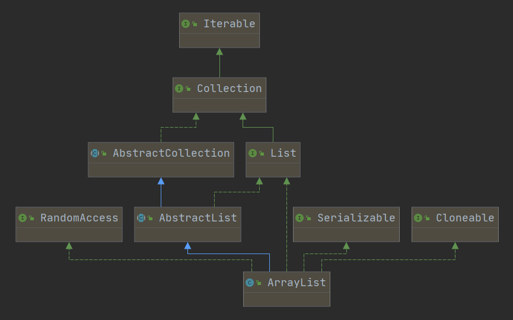
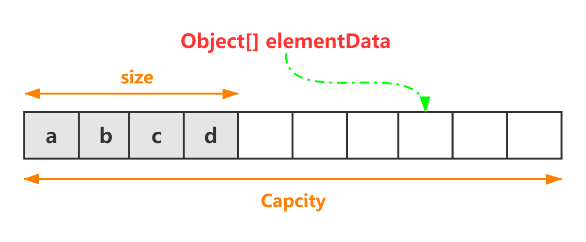
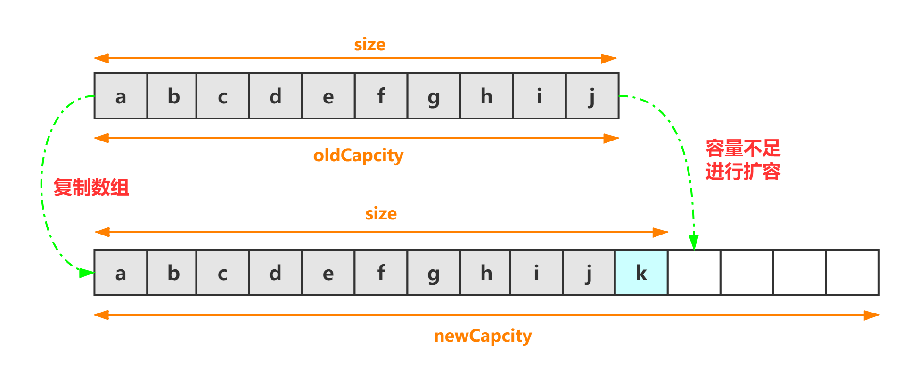
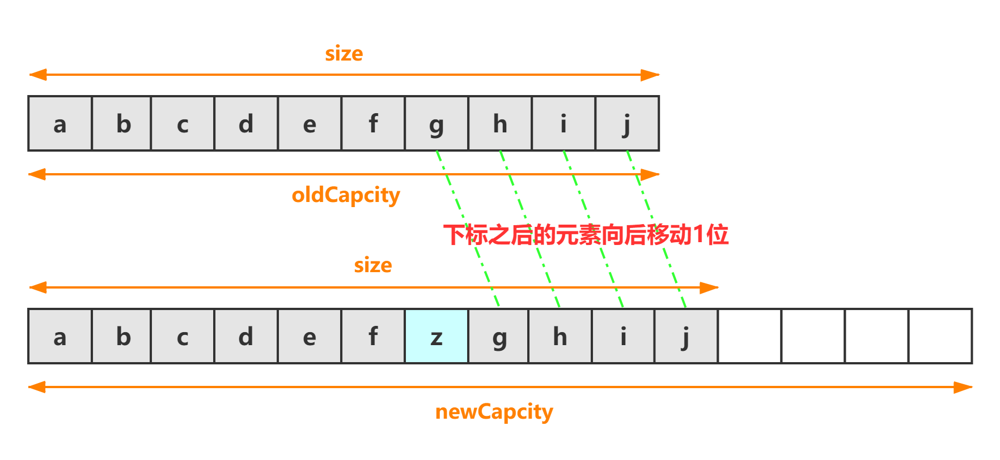
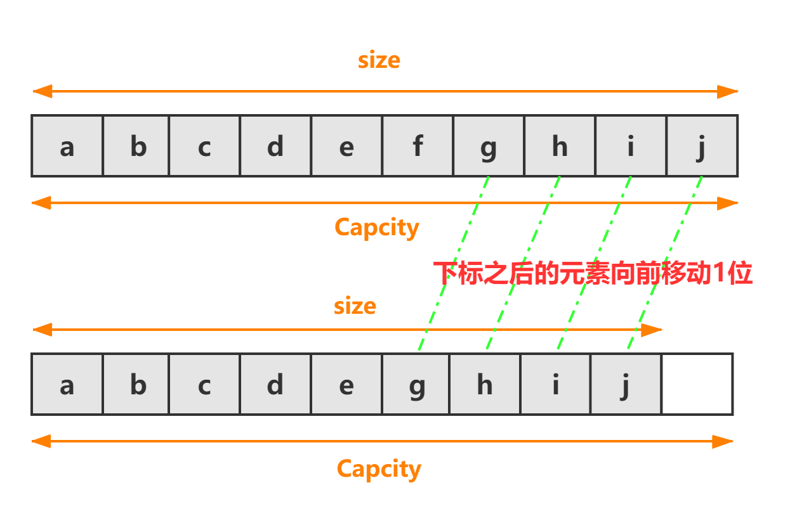

## 1、ArrayList

ArrayList 内部使用 **数组** 进行存储。**初始容量为 10**，该容量代表了数组的大小。当容器中的元素不断增加时，集合扩容时会创建更大的数组空间。**最好指定一个初始容量值**，避免过多的进行扩容操作而浪费时间、效率

- ArrayList 擅长于随机访问，但插入和删除时速度通常很慢，因为可能需要移动其他元素

### 1.1  实现接口与父类



- ArrayList 实现了三个标识接口 `RandomAccess`、`Serializable`、`Cloneable`
  - `RandomAccess`：支持快速随机访问
  - `Serializable`：支持序列化
  - ``Cloneable`：支持克隆

- ArrayList 继承了 `AbstractList` 抽象类，实现了 `List` 接口，提供了添加、删除、修改、遍历等功能

## 2、ArrayList 中的属性

```java
// 默认初始容量大小
private static final int DEFAULT_CAPACITY = 10;

// 如果自定义容量为0，则会默认用它来初始化ArrayList，或者用于空数组替换
private static final Object[] EMPTY_ELEMENTDATA = {};

// 如果没有自定义容量，则会使用它来初始化ArrayList，或者用于空数组比对
private static final Object[] DEFAULTCAPACITY_EMPTY_ELEMENTDATA = {};

// 保存到ArrayList的元素
transient Object[] elementData;

// ArrayList实际大小
private int size;

// 最大数组的大小
private static final int MAX_ARRAY_SIZE = Integer.MAX_VALUE - 8;
```



### 2.1  `EMPTY_ELEMENTDATA` 与 `DEFAULTCAPACITY_EMPTY_ELEMENTDATA`

- EMPTY_ELEMENTDATA：用在有参构造函数当初始容量为 0 时共享赋值用
- DEFAULTCAPACITY_EMPTY_ELEMENTDATA：用在无参构造函数赋值用

两者都是用来减少空数组的创建，所有空 ArrayList 都共享空数组。两者的区别主要是用来做区分用，针对有参无参的构造在扩容时做区分进行不同的扩容逻辑，优化性能

*更多：[java集合-ArrayList中EMPTY_ELEMENTDATA与DEFAULTCAPACITY_EMPTY_ELEMENTDATA的区别 ](https://www.cnblogs.com/zh-ch/p/12762619.html)*

### 2.2  elementData 数组为什么被 `transient` 修饰

通常被 `transient` 修饰的属性不会被序列化，但 ArrayList 仍可以成功进行序列化，因为 ArrayList 会自动调用 writeObject 和 readObject 进行序列化和反序列化

因为 elementData 是一个缓存数组，它通常会预留一些容量，在容量不足时会扩充容量，有些空间可能就没有存入元素，使用 writeObject 和 readObject 进行序列化和反序列化，就可以保证只序列化实际存储的那些元素，而不是整个数组，从而节省空间和时间

```java
public class Test {
    public static void main(String[] args) throws Exception {
        List<String> list = new ArrayList<>();
        list.add("a");
        list.add("b");
        list.add("c");
        list.add("d");

        // 通过反射获取数组的长度
        Field f1 = ArrayList.class.getDeclaredField("elementData");
        f1.setAccessible(true);
        Object[] o1s = (Object[]) f1.get(list);
        System.out.println(o1s.length);
        System.out.println(Arrays.toString(o1s));
        
        // 序列化
        File file = new File("list");
        try {
            ObjectOutputStream oos = new ObjectOutputStream(new FileOutputStream(file));
            oos.writeObject(list);
            oos.flush();
        } catch (Exception e) {
            e.printStackTrace();
        }

        // 反序列化
        ObjectInputStream ois;
        ArrayList<String> l2 = null;
        try {
            ois = new ObjectInputStream(new FileInputStream(file));
            l2 = (ArrayList<String>) ois.readObject();
        } catch (Exception e) {
            e.printStackTrace();
        }

        // 通过反射获取数组的长度
        Field f2 = ArrayList.class.getDeclaredField("elementData");
        f2.setAccessible(true);
        Object[] o2s = (Object[]) f2.get(l2);
        System.out.println(o2s.length);
        System.out.println(Arrays.toString(o2s));
    }
}

```

- 可以看出序列化之前，数组的长度为 10，序列化之后，数组的长度变为实际存入元素大小

> 10
> [a, b, c, d, null, null, null, null, null, null]
> 4
> [a, b, c, d]

#### 2.2.1  `writeObject` 与 `readObject`

```java
private void writeObject(java.io.ObjectOutputStream s) throws java.io.IOException{
    // Write out element count, and any hidden stuff
    int expectedModCount = modCount;
    s.defaultWriteObject();

    // Write out size as capacity for behavioural compatibility with clone()
    s.writeInt(size);

    // Write out all elements in the proper order.
    for (int i=0; i<size; i++) {
        s.writeObject(elementData[i]);
    }

    if (modCount != expectedModCount) {
        throw new ConcurrentModificationException();
    }
}

private void readObject(java.io.ObjectInputStream s) throws java.io.IOException, ClassNotFoundException {
    elementData = EMPTY_ELEMENTDATA;

    // Read in size, and any hidden stuff
    s.defaultReadObject();

    // Read in capacity
    s.readInt(); // ignored

    if (size > 0) {
        // be like clone(), allocate array based upon size not capacity
        int capacity = calculateCapacity(elementData, size);
        SharedSecrets.getJavaOISAccess().checkArray(s, Object[].class, capacity);
        ensureCapacityInternal(size);

        Object[] a = elementData;
        // Read in all elements in the proper order.
        for (int i=0; i<size; i++) {
            a[i] = s.readObject();
        }
    }
}
```

## 3、构造方法

```java
// 指定初始容量的构造方法
public ArrayList(int initialCapacity) {
    if (initialCapacity > 0) {
        // 如果传入参数大于0，则创建initialCapacity大小的数组
        this.elementData = new Object[initialCapacity];
    } else if (initialCapacity == 0) {
        // 如果传入参数等于0，则指向一个空数组
        this.elementData = EMPTY_ELEMENTDATA;
    } else {
        throw new IllegalArgumentException("Illegal Capacity: " + initialCapacity);
    }
}

// 无参构造方法
public ArrayList() {
    this.elementData = DEFAULTCAPACITY_EMPTY_ELEMENTDATA;
}

// 构造一个包含指定集合的ArrayList
public ArrayList(Collection<? extends E> c) {
    // 将传入的集合转为数组
    elementData = c.toArray();
    if ((size = elementData.length) != 0) {
        // c.toArray可能返回的不是Object类型的数组
        if (elementData.getClass() != Object[].class) {
            // 将不为Object类型的elementData数组，复制到新的Object类型elementData数组
            elementData = Arrays.copyOf(elementData, size, Object[].class);
        }
    } else {
        // 如果传入的集合大小为0，则指向一个空数组
        this.elementData = EMPTY_ELEMENTDATA;
    }
}
```

## 4、常用方法

### 4.1  添加元素

**集合的容量不会在 new 的时候分配，而在第一次加入数据时分配**

#### 4.1.1  添加元素到尾部



```java
// 将传入的元素插入到尾部
public boolean add(E e) {
    // 调用获得最小容量的方法
    ensureCapacityInternal(size + 1);
    elementData[size++] = e;
    return true;
}

// 获得最小容量
private void ensureCapacityInternal(int minCapacity) {
    // 先计算容量，再判断是否需要扩容
    ensureExplicitCapacity(calculateCapacity(elementData, minCapacity));
}

// 计算容量
private static int calculateCapacity(Object[] elementData, int minCapacity) {
    // 如果传入的数组为空数组，则返回DEFAULT_CAPACITY与minCapacity中最大的数
    if (elementData == DEFAULTCAPACITY_EMPTY_ELEMENTDATA) {
        return Math.max(DEFAULT_CAPACITY, minCapacity);
    }
    // 如果不为空数组，则返回minCapacity
    return minCapacity;
}

// 判断是否需要扩容
private void ensureExplicitCapacity(int minCapacity) {
    // 继承于AbstractList，记录着集合的修改次数
    modCount++;

    // 当所需最小容量大于elementData数组的长度，则进行扩容
    if (minCapacity - elementData.length > 0) {
        grow(minCapacity);
    }
}

// 扩容方法
private void grow(int minCapacity) {
    // 旧容量
    int oldCapacity = elementData.length;
    // 新容量，扩容1.5倍，向下取整
    int newCapacity = oldCapacity + (oldCapacity >> 1);
    // 当新容量仍小于所需最小容量，则把所需最小容量当作数组的新容量
    if (newCapacity - minCapacity < 0){
        newCapacity = minCapacity;
    }
    // 当新容量大于最大容量时,调用hugeCapacity方法
    if (newCapacity - MAX_ARRAY_SIZE > 0) {
        // 传入所需最小容量
        newCapacity = hugeCapacity(minCapacity);
    }
    // 复制数组，将当前数组的元素复制到新容量的数组中
    elementData = Arrays.copyOf(elementData, newCapacity);
}

// 当新容量大于最大容量时，调用该方法
private static int hugeCapacity(int minCapacity) {
    // 溢出
    if (minCapacity < 0) {
        throw new OutOfMemoryError();
    }
    // 如果所需最小容量大于最大容量，则将Integer.MAX_VALUE作为新数组大小，否则MAX_ARRAY_SIZE作为新数组大小
    return (minCapacity > MAX_ARRAY_SIZE) ? Integer.MAX_VALUE : MAX_ARRAY_SIZE;
}
```

#### 4.1.2  添加元素到指定位置



```java
// 将传入的元素插入到指定位置
public void add(int index, E element) {
    // 检查传入的下标是否越界
    rangeCheckForAdd(index);
	// 调用获得最小容量的方法
    ensureCapacityInternal(size + 1);
    // 复制数组，其实就是将传入的下标位置后的所有元素向后移一位
    System.arraycopy(elementData, index, elementData, index + 1, size - index);
    // 将数组的指定位置设为传入的元素
    elementData[index] = element;
    size++;
}

// 界限检查
private void rangeCheckForAdd(int index) {
    // 如果传入的小标大于已有的元素个数或者小于0，则抛出异常
    if (index > size || index < 0) {
        throw new IndexOutOfBoundsException(outOfBoundsMsg(index));
    }
}

// 错误信息
private String outOfBoundsMsg(int index) {
    return "Index: "+index+", Size: "+size;
}
```

#### 4.1.3  `Arrays.copyOf` 与 `System.arraycopy`

`Arrays.copyOf` 内部调用的也是 `System.arraycopy`，而 `System.arraycopy` 是一个本地方法

- `Arrays.copyOf` 主要用来将原数组全部拷贝到一个新长度的数组，适用于数组扩容

```java
// original：源数组，newLength：新的数组长度，newType：返回的数组类型
public static <T,U> T[] copyOf(U[] original
                               int newLength
                               Class<? extends T[]> newType) {
    @SuppressWarnings("unchecked")
    T[] copy = ((Object)newType == (Object)Object[].class) ? (T[]) new Object[newLength] : (T[]) Array.newInstance(newType.getComponentType(), newLength);
    System.arraycopy(original, 0, copy, 0, Math.min(original.length, newLength));
    return copy;
}
```

```java
// src：源数组，srcPos：复制源数组的起始位置，dest：目标数组，destPos：目标数组下标位置，length：要复制的长度
public static native void arraycopy(Object src, 
                                    int srcPos, 
                                    Object dest, 
                                    int destPos,
                                    int length);
```

### 4.2  获得元素

```java
// 根据下标获取元素
public E get(int index) {
    // 检查传入的下标是否越界
    rangeCheck(index);
    return elementData(index);
}

// 根据下标获取数组中的元素
E elementData(int index) {
    return (E) elementData[index];
}

// 界限检查
private void rangeCheck(int index) {
    // 如果传入的下标大于已有元素的个数，则抛出异常
    if (index >= size) {
        throw new IndexOutOfBoundsException(outOfBoundsMsg(index));
    }
}
```

### 4.3  修改元素

```java
public E set(int index, E element) {
    // 检查是否越界
    rangeCheck(index);
	// 获得旧值，用于返回
    E oldValue = elementData(index);
    // 修改值
    elementData[index] = element;
    return oldValue;
}
```

### 4.4  删除元素



```java
// 根据下标删除元素
public E remove(int index) {
    // 检查是否越界
    rangeCheck(index);
	// 记录集合的修改次数
    modCount++;
    // 获得旧值，用于返回
    E oldValue = elementData(index);
    // 复制数组，其实就是将传入的下标位置后的所有元素向前移一位
    int numMoved = size - index - 1;
    if (numMoved > 0) {
        System.arraycopy(elementData, index+1, elementData, index, numMoved);
    }
    // 最后一位指向null
    elementData[--size] = null; // clear to let GC do its work
    return oldValue;
}

// 删除传入的元素
public boolean remove(Object o) {
    // 因为ArrayList可以保存null，所以传入的元素为null也可以进行操作
    if (o == null) {
        for (int index = 0; index < size; index++) {
            // 查找元素为null的下标，传入fastRemove方法，只删除查到的第一个元素
            if (elementData[index] == null) {
                fastRemove(index);
                return true;
            }
        }
    } else {
        for (int index = 0; index < size; index++) {
            // 查找元素等于传入元素的下标，传入fastRemove方法，只删除查到的第一个元素
            if (o.equals(elementData[index])) {
                fastRemove(index);
                return true;
            }
        }
    }
    return false;
}

// 与remove(int index)方法类似，没有返回值，没有越界检查
private void fastRemove(int index) {
    modCount++;
    int numMoved = size - index - 1;
    if (numMoved > 0) {
        System.arraycopy(elementData, index+1, elementData, index, numMoved);
    }
    elementData[--size] = null; // clear to let GC do its work
}
```

### 4.5  其他方法

#### 4.5.1  最小化ArrayList

修改 ArrayList 的容量为当前存入元素的大小

```java
public void trimToSize() {
    modCount++;
    // 如果实际大小小于当前容量，则进行优化
    if (size < elementData.length) {
        // 如果实际大小为0，则指向空数组，否则将元素复制到实际大小数量的数组中
        elementData = (size == 0) ? EMPTY_ELEMENTDATA : Arrays.copyOf(elementData, size);
    }
}
```

#### 4.5.2  返回元素数量

```java
public int size() {
    return size;
}
```

#### 4.5.3  判断是否为空

```java
public boolean isEmpty() {
    return size == 0;
}
```

#### 4.5.4  判断是否包含某个元素

调用 `indexOf` 方法

```java
public boolean contains(Object o) {
    return indexOf(o) >= 0;
}
```

#### 4.5.5  返回指定元素的下标，没有则返回 `-1`

```java
// 返回指定元素第一次出现的下标
public int indexOf(Object o) {
    if (o == null) {
        for (int i = 0; i < size; i++) {
            if (elementData[i]==null) {
                return i;
            }
        }
    } else {
        for (int i = 0; i < size; i++) {
            if (o.equals(elementData[i])) {
                return i;
            }
        }
    }
    return -1;
}

// 返回指定元素最后一次出现的下标
public int lastIndexOf(Object o) {
    if (o == null) {
        for (int i = size-1; i >= 0; i--) {
            if (elementData[i]==null) {
                return i;
            }
        }
    } else {
        for (int i = size-1; i >= 0; i--) {
            if (o.equals(elementData[i])) {
                return i;
            }
        }
    }
    return -1;
}
```

#### 4.5.6  转换为数组

```java
// 转换为数组
public Object[] toArray() {
    return Arrays.copyOf(elementData, size);
}

// 转换为指定类型数组
public <T> T[] toArray(T[] a) {
    // 如果传入的数组大小小于实际容量，则将elementData数组中的元素复制到实际容量大小的a类型新数组中
    if (a.length < size) {
        // Make a new array of a's runtime type, but my contents:
        return (T[]) Arrays.copyOf(elementData, size, a.getClass());
    }
	// 复制数组
    System.arraycopy(elementData, 0, a, 0, size);
    // 如果传入的数组大小大于实际容量，则将最后一位指向null
    if (a.length > size) {
        a[size] = null;
    }
    return a;
}
```

```java
public class Test {
    public static void main(String[] args) {
        List<String> list = new ArrayList<>();
        list.add("a");
        list.add("b");
        list.add("c");
        list.add("d");
        System.out.println(Arrays.toString(list.toArray()));
        System.out.println(Arrays.toString(list.toArray(new String[10])));
    }
}
```

> [a, b, c, d]
> [a, b, c, d, null, null, null, null, null, null]

#### 4.5.7  清空ArrayList

```java
public void clear() {
    modCount++;

    // clear to let GC do its work
    for (int i = 0; i < size; i++) {
        // 将数组中所有元素都指向null
        elementData[i] = null;
    }
    size = 0;
}
```

#### 4.5.8  添加传入的集合

```java
// 将传入的集合添加到尾部
public boolean addAll(Collection<? extends E> c) {
    // 将传入的集合转换为数组
    Object[] a = c.toArray();
    int numNew = a.length;
    // 调用获得最小容量的方法
    ensureCapacityInternal(size + numNew);  // Increments modCount
    // 将a数组中的元素复制到elementData数组尾部
    System.arraycopy(a, 0, elementData, size, numNew);
    size += numNew;
    return numNew != 0;
}

// 将传入的集合添加到指定位置
public boolean addAll(int index, Collection<? extends E> c) {
    // 检查是否越界
    rangeCheckForAdd(index);

    Object[] a = c.toArray();
    int numNew = a.length;
    // 调用获得最小容量的方法
    ensureCapacityInternal(size + numNew);  // Increments modCount
	// 将elementData数组指定下标后的元素，向后移动传入元素的长度
    int numMoved = size - index;
    if (numMoved > 0) {
        System.arraycopy(elementData, index, elementData, index + numNew, numMoved);
    }
	// 将a数组中的元素复制到elementData数组指定位置
    System.arraycopy(a, 0, elementData, index, numNew);
    size += numNew;
    return numNew != 0;
}
```

```java
public class Test {
    public static void main(String[] args) {
        List<String> l1 = getArrayList();
        List<String> l2 = getLinkedList();
        // 将传入的集合添加到尾部
        l1.addAll(l2);
        System.out.println(l1);

        List<String> l3 = getArrayList();
        // 将传入的集合添加到指定位置
        l3.addAll(2, l2);
        System.out.println(l3);
    }

    static List<String> getArrayList() {
        List<String> list = new ArrayList<>();
        list.add("a");
        list.add("b");
        list.add("c");
        list.add("d");
        return list;
    }

    static List<String> getLinkedList() {
        List<String> list = new LinkedList<>();
        list.add("one");
        list.add("two");
        list.add("three");
        return list;
    }
}
```

> [a, b, c, d, one, two, three]
> [a, b, one, two, three, c, d]

#### 4.5.9  移除范围内的元素

主要交由内部类 SubList 进行调用

```java
protected void removeRange(int fromIndex, int toIndex) {
    modCount++;
    // 数组所需移动的长度
    int numMoved = size - toIndex;
    System.arraycopy(elementData, toIndex, elementData, fromIndex, numMoved);

    // clear to let GC do its work
    int newSize = size - (toIndex-fromIndex);
    for (int i = newSize; i < size; i++) {
        elementData[i] = null;
    }
    size = newSize;
}
```

#### 4.5.10  删除或保留指定元素

```java
// 删除传入的集合中的指定元素
public boolean removeAll(Collection<?> c) {
    Objects.requireNonNull(c);
    return batchRemove(c, false);
}

// 保留传入的集合中的指定元素
public boolean retainAll(Collection<?> c) {
    Objects.requireNonNull(c);
    return batchRemove(c, true);
}

private boolean batchRemove(Collection<?> c, boolean complement) {
    final Object[] elementData = this.elementData;
    int r = 0, w = 0;
    boolean modified = false;
    try {
        for (; r < size; r++) {
            if (c.contains(elementData[r]) == complement) {
                elementData[w++] = elementData[r];
            }
        }
    } finally {
        // Preserve behavioral compatibility with AbstractCollection,
        // even if c.contains() throws.
        if (r != size) {
            System.arraycopy(elementData, r, elementData, w, size - r);
            w += size - r;
        }
        if (w != size) {
            // clear to let GC do its work
            for (int i = w; i < size; i++) {
                elementData[i] = null;
            }
            modCount += size - w;
            size = w;
            modified = true;
        }
    }
    return modified;
}
```

```java
public class Test {
    public static void main(String[] args) {
        List<String> l1 = getArrayList();
        List<String> l2 = getLinkedList();
        删除传入的集合中的指定元素
        l1.removeAll(l2);
        System.out.println(l1);

        List<String> l3 = getArrayList();
        // 保留传入的集合中的指定元素
        l3.retainAll(l2);
        System.out.println(l3);
    }

    static List<String> getArrayList() {
        List<String> list = new ArrayList<>();
        list.add("a");
        list.add("b");
        list.add("c");
        list.add("d");
        list.add("e");
        list.add("f");
        return list;
    }

    static List<String> getLinkedList() {
        List<String> list = new LinkedList<>();
        list.add("a");
        list.add("d");
        return list;
    }
}
```

> [b, c, e, f]
> [a, d]

#### 4.5.11 迭代器

```java
// 从指定下标处开始迭代
public ListIterator<E> listIterator(int index) {
    if (index < 0 || index > size) {
        throw new IndexOutOfBoundsException("Index: "+index);
    }
    return new ListItr(index);
}

// 迭代器
public ListIterator<E> listIterator() {
    return new ListItr(0);
}

// 迭代器
public Iterator<E> iterator() {
    return new Itr();
}

// 可拆分迭代器，为并行执行而设计
@Override
public Spliterator<E> spliterator() {
    return new ArrayListSpliterator<>(this, 0, -1, 0);
}
```

- ListIterator 与 Iterator

|      ListIterator      |   Iterator   |
| :--------------------: | :----------: |
| 可以向 List 中添加对象 |     不能     |
|        双向遍历        | 顺序向后遍历 |
|  可以从指定下标处遍历  |     不能     |
|      可以删除元素      | 可以删除元素 |
|      可以修改元素      |     不能     |

#### 4.5.12 返回 ArrayList 的部分视图

```java
public List<E> subList(int fromIndex, int toIndex) {
    // 检查传入的下标是否越界
    subListRangeCheck(fromIndex, toIndex, size);
    return new SubList(this, 0, fromIndex, toIndex);
}

// 界限检查
static void subListRangeCheck(int fromIndex, int toIndex, int size) {
    // 如果起始下标小于0，则抛出异常
    if (fromIndex < 0) {
        throw new IndexOutOfBoundsException("fromIndex = " + fromIndex);
    }

    // 如果终止下标大于已有的元素个数，则抛出异常
    if (toIndex > size) {
        throw new IndexOutOfBoundsException("toIndex = " + toIndex);
    }
    
    //  如果终止下标大于起始下标，则抛出异常
    if (fromIndex > toIndex) {
        throw new IllegalArgumentException("fromIndex(" + fromIndex + ") > toIndex(" + toIndex + ")");
    }
}
```

```java
public class ArrayList2Test {
    public static void main(String[] args) {
        List<String> list = new ArrayList<>();
        list.add("a");
        list.add("b");
        list.add("c");
        list.add("d");
        list.add("e");
        list.add("f");

        List<String> subList = list.subList(2, 5);
        System.out.println(subList);
    }
}
```

> [c, d, e]

#### 4.5.13  遍历

```java
@Override
public void forEach(Consumer<? super E> action) {
    Objects.requireNonNull(action);
    final int expectedModCount = modCount;
    @SuppressWarnings("unchecked")
    final E[] elementData = (E[]) this.elementData;
    final int size = this.size;
    for (int i=0; modCount == expectedModCount && i < size; i++) {
        action.accept(elementData[i]);
    }
    if (modCount != expectedModCount) {
        throw new ConcurrentModificationException();
    }
}
```

#### 4.5.14  根据规则过滤集合中的元素

```java
@Override
public boolean removeIf(Predicate<? super E> filter) {
    Objects.requireNonNull(filter);
    // figure out which elements are to be removed
    // any exception thrown from the filter predicate at this stage
    // will leave the collection unmodified
    int removeCount = 0;
    final BitSet removeSet = new BitSet(size);
    final int expectedModCount = modCount;
    final int size = this.size;
    for (int i=0; modCount == expectedModCount && i < size; i++) {
        @SuppressWarnings("unchecked")
        final E element = (E) elementData[i];
        if (filter.test(element)) {
            removeSet.set(i);
            removeCount++;
        }
    }
    if (modCount != expectedModCount) {
        throw new ConcurrentModificationException();
    }

    // shift surviving elements left over the spaces left by removed elements
    final boolean anyToRemove = removeCount > 0;
    if (anyToRemove) {
        final int newSize = size - removeCount;
        for (int i=0, j=0; (i < size) && (j < newSize); i++, j++) {
            i = removeSet.nextClearBit(i);
            elementData[j] = elementData[i];
        }
        for (int k=newSize; k < size; k++) {
            elementData[k] = null;  // Let gc do its work
        }
        this.size = newSize;
        if (modCount != expectedModCount) {
            throw new ConcurrentModificationException();
        }
        modCount++;
    }

    return anyToRemove;
}
```


```java
@Override
@SuppressWarnings("unchecked")
public void replaceAll(UnaryOperator<E> operator) {
    Objects.requireNonNull(operator);
    final int expectedModCount = modCount;
    final int size = this.size;
    for (int i=0; modCount == expectedModCount && i < size; i++) {
        elementData[i] = operator.apply((E) elementData[i]);
    }
    if (modCount != expectedModCount) {
        throw new ConcurrentModificationException();
    }
    modCount++;
}
```


```java
@Override
@SuppressWarnings("unchecked")
public void sort(Comparator<? super E> c) {
    final int expectedModCount = modCount;
    Arrays.sort((E[]) elementData, 0, size, c);
    if (modCount != expectedModCount) {
        throw new ConcurrentModificationException();
    }
    modCount++;
}
```


